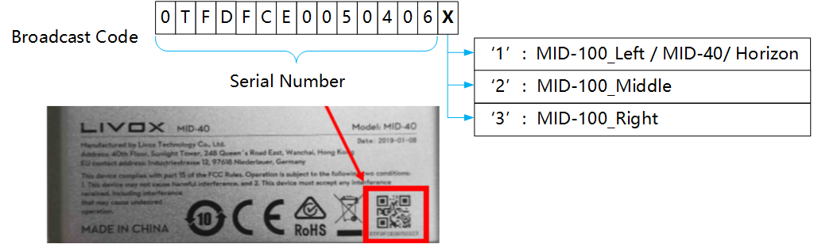

# Livox ROS Driver（钛兴科技定制版）

本分支基于官方 [livox_ros_driver v2.6.0](https://github.com/Livox-SDK/livox_ros_driver) 修改，面向**多雷达 + 工业环境长时间运行**场景，新增以下功能与可靠性修复：

1. **在线工作模式切换** — 运行时通过 ROS Service 切换 LiDAR 工作模式（Normal / PowerSaving / Standby）
2. **远程重启** — 通过 ROS Service 软重启雷达，无需现场断电
3. **可配置点云距离过滤** — 通过 launch 参数设置最大发布距离，无需重新编译
4. **掉线崩溃修复（UAF）** — 修复官方驱动在雷达掉线时的 use-after-free 竞态崩溃
5. **状态抖动断流修复** — 避免温度/电机告警等瞬时状态抖动导致话题断流
6. **健康与丢包监控** — 异常日志告警 + `livox/lidar_stats` 实时看板（温度/风扇/**电机**状态、丢包、掉线，独立终端原地刷新，底部含**故障/自动恢复历史**）
7. **畸形包硬化** — 拒绝非法 `data_type`，堵住缓冲区溢出
8. **零点洪泛防护** — 大丢包/掉线时限制零点回填，避免整片假点污染融合点云
9. **自动恢复看门狗（可选）** — 检测到假活（`Normal` 但无数据）或 `Error`（如电机故障）时自动重启该雷达，带重试上限防死循环
10. **持久化健康日志（可选）** — 把健康事件与网络趋势落盘成 CSV（边沿事件 + 周期快照），供长期无人值守的趋势分析与故障取证

> 功能 1/2 需配套修改版 SDK；功能 3~10 为纯 ROS 驱动层改动，配任意 SDK 均可用。详见各章节。

---

## 快速开始

### 前置条件

- Ubuntu 20.04 + ROS Noetic
- **必须使用修改版 Livox SDK**（见下方"Livox SDK 修改"章节）

### 编译

```bash
cd ~/catkin_ws
catkin_make -DPYTHON_EXECUTABLE=/usr/bin/python3
source devel/setup.bash
```

> - 加 `-DPYTHON_EXECUTABLE=/usr/bin/python3` 是**强制 catkin 用系统 python3**，避免 conda 等环境让它选错 python（否则编译或运行报 python 相关错）。比 `conda deactivate` 更稳，不受当前环境影响。
> - 新版 CMake（≥3.27）若报 policy 版本错，再补 `-DCMAKE_POLICY_VERSION_MINIMUM=3.5`。
> - ⚠️ **编译用的 `catkin_ws` 必须和下面 systemd 服务里 `source` 的是同一个目录**，否则你编译了、服务却跑的是另一份旧的，改动不生效还极难排查。

### 启动

```bash
# 单雷达
roslaunch livox_ros_driver livox_lidar.launch

# 多雷达
roslaunch livox_ros_driver livox_lidar_multi.launch
```

> 上面是**手动启动**（在桌面上调试用，会自动弹看板）。**生产 24/7 无人值守请用下面的 systemd 服务**，不要手动 roslaunch。

### 生产部署（systemd：开机自启 + 崩溃自重启 + 无人值守自愈）

把驱动跑成系统服务，这样**断电通电后自动启动、进程崩溃后自动重启**，无需人工敲命令。

**① 服务文件** `/etc/systemd/system/livox-ros-driver.service`（把 `<USER>` 换成实际用户名）：

```ini
[Unit]
Description=Livox ROS Driver
After=network-online.target roscore.service
Wants=network-online.target
Wants=roscore.service

[Service]
Type=simple
User=<USER>
Group=<USER>
WorkingDirectory=/home/<USER>
Environment=HOME=/home/<USER>
Environment=ROS_MASTER_URI=http://localhost:11311
Environment=ROS_HOSTNAME=localhost
# ⚠️ 这里 source 的 catkin_ws 必须和你编译用的是同一个目录
ExecStart=/bin/bash -lc 'source /opt/ros/noetic/setup.bash && source /home/<USER>/catkin_ws/devel/setup.bash && exec roslaunch livox_ros_driver livox_lidar_multi.launch monitor:=false auto_recover:=true health_log:=true'
Restart=always
RestartSec=5

[Install]
WantedBy=multi-user.target
```

**② 为什么 ExecStart 末尾要带这三个参数**（命令行 `arg:=value` 会覆盖 launch 文件的默认值，且贯穿到驱动）：

| 参数 | 生产值 | 原因 |
|------|--------|------|
| `monitor` | **`false`** | 后台服务**无图形界面**，自动弹 `gnome-terminal` 看板会弹不出来报错。想看看板时单独 `rosrun livox_ros_driver livox_stats_monitor.py` |
| `auto_recover` | **`true`** | 无人值守时雷达故障（假活 / `Error`）**自动重启自愈**，不必等人 |
| `health_log` | **`true`** | 健康事件 + 网络趋势**落盘取证**，供事后排查 |

> 这三个值只对服务生效；你**手动 `roslaunch`** 时不带参数，仍是 `monitor:=true`（看板弹出）等默认值，两个场景各取所需、互不影响。

**③ 启用并启动**：

```bash
sudo systemctl daemon-reload
sudo systemctl enable livox-ros-driver     # 开机自启（光有 [Install] 还不够，必须 enable）
sudo systemctl restart livox-ros-driver
```

**④ 验证全部生效**：

```bash
# 自愈 + 日志开了没（应看到两条 ENABLED）
journalctl -u livox-ros-driver -b | grep -iE "Auto-recover|Health logging"
# 开机自启开了没（应显示 enabled）
systemctl is-enabled livox-ros-driver
```

> ⚠️ **`health_log` 的目录必须先存在**：若用了 `health_log_dir:=/some/path`，先 `mkdir -p /some/path`；否则首次写盘失败会**自动禁用日志**（驱动不受影响，但日志不写）。确认日志在写：`ls -la <日志目录>/`，应出现 `livox_events_YYYY-MM-DD.csv`（快照文件 `livox_snapshot_*` 要等第一个周期，默认 10 分钟）。

---

## 新增功能一：在线工作模式切换

### 使用方法

启动驱动后，在另一个终端执行：

```bash
# 切换到节电模式（电机停转，低功耗）
rosservice call /livox_lidar_mode "{handle: 0, mode: 2}"

# 切回正常模式（电机启动，正常出点）
rosservice call /livox_lidar_mode "{handle: 0, mode: 1}"

# 切换到待机模式
rosservice call /livox_lidar_mode "{handle: 0, mode: 3}"

# 所有雷达同时切换（handle 设为 255）
rosservice call /livox_lidar_mode "{handle: 255, mode: 2}"
```

### 参数说明

| 参数 | 取值 | 说明 |
|------|------|------|
| `handle` | 0~31 | 单个雷达的设备句柄（启动日志中 `Lidar[X]` 的 X 即为 handle）|
| `handle` | 255 | 广播模式，对所有已连接的雷达同时生效 |
| `mode` | 1 | Normal — 正常工作，电机旋转，输出点云 |
| `mode` | 2 | PowerSaving — 节电模式，电机停转 |
| `mode` | 3 | Standby — 待机模式，电机停转 |

### 返回值

| `ret_code` | 含义 |
|------------|------|
| 0 | 请求已接受 |
| 非 0 | 错误（详见终端日志）|

### 断线行为

| 场景 | 行为 |
|------|------|
| Normal 模式下断线 | 3 秒检测到，重连后自动恢复采样 |
| PowerSaving / Standby 下断线 | 15 秒检测到，重连后恢复 Normal 模式 |
| 切换 Normal 时通信失败 | 自动等待重连后重试 |

### 远程重启

当雷达进入异常状态（如长时间运行后丢包/无响应），可以远程软重启，无需现场断电：

```bash
# 重启单台雷达
rosservice call /livox_lidar_reboot "{handle: 0}"

# 重启所有已连接雷达
rosservice call /livox_lidar_reboot "{handle: 255}"
```

| 参数 | 取值 | 说明 |
|------|------|------|
| `handle` | 0~31 | 单个雷达句柄 |
| `handle` | 255 | 所有已连接雷达 |

> 调用 SDK 的 `RebootDevice()`，雷达会断开并在数秒后重新上线，驱动的重连逻辑会自动恢复采样。Horizon 支持；Mid40/100 需固件 ≥ 03.07。

---

## 新增功能二：可配置点云距离过滤

发布前过滤超出指定距离的点，减少下游处理数据量。

### 使用方法

```bash
# 只发布 5 米以内的点
roslaunch livox_ros_driver livox_lidar.launch max_distance:=5.0

# 只发布 2 米以内的点
roslaunch livox_ros_driver livox_lidar.launch max_distance:=2.0

# 禁用过滤，发布所有点（默认）
roslaunch livox_ros_driver livox_lidar.launch max_distance:=0
```

也可在 launch 文件中修改默认值：

```xml
<arg name="max_distance" default="5.0"/>
```

### 参数说明

| 参数 | 类型 | 默认值 | 说明 |
|------|------|--------|------|
| `max_distance` | double | 0.0 | 最大发布距离（米），0 表示禁用过滤 |

启动时终端会输出确认信息：
```
[ INFO] Distance filter enabled: max_distance = 5.00 m
```

### 三种点云格式均支持

距离过滤对以下三种输出格式都生效（`xfer_format` 参数）：
- `0` — PointCloud2 (PointXYZRTL)
- `1` — Livox CustomMsg
- `2` — PCL PointXYZI

---

## 新增功能三：可靠性修复（多雷达长时间运行）

> 以下为纯 ROS 驱动层修复，不需要改 SDK。

### 1. 掉线崩溃（use-after-free）修复

**官方 bug**：雷达掉线时，`ResetLidar` 在 SDK 设备状态线程上释放数据队列，而 SDK 数据接收线程仍可能往同一队列写入——两者无任何锁同步，导致 **use-after-free / 堆损坏**，在多雷达偶发掉线时崩溃或话题假死。

**修复**：为每台雷达引入一把 `std::mutex`，把**写入（StorageRawPacket）/ 读取（DistributeLidarData）/ 释放（ResetLidar）** 三条路径互斥；并在 `DeInitQueue` 释放后置空指针、各队列操作加空指针兜底。从根上消除竞态（区别于裸 null 检查的临时补丁）。

### 2. 状态抖动导致话题断流修复

**问题**：早期版本在雷达状态从「任意非 Normal → Normal」时都会重置 `connect_state` 重跑配置，于是**温度/电机告警等瞬时 Error→Normal 抖动**也会触发完整重配置 → 话题断流几百 ms。工业现场高温、震动环境下频繁发生。

**修复**：仅在「确实从节电/待机恢复」或「我们主动请求的 Normal 切换正在完成」时才重配置，瞬时告警抖动不再打断已在采样的雷达。

### 3. 零点洪泛防护（大丢包/掉线时）

**官方行为**：检测到时间戳缺口（丢包或短暂掉线）时，驱动会用**零点包**（点全在原点 0,0,0）回填以保持时间戳连续。但回填**无上限**——长掉线或重丢包时会把整个发布预算耗在零点包上，导致下游连续多帧收到整片原点假点，污染多雷达融合点云、浪费 CPU/带宽，还会掩盖真正在退化的雷达。

**修复**：每帧点云的零点回填**最多 10 个包**（`kMaxZeroFillPacketPerMsg`），到上限即停止补零、转去处理真实包并重同步时间戳。三处发布路径（`PublishPointcloud2` / `PublishPointcloudData` / `PublishCustomPointcloud`）一致生效。正常无缺口时计数恒为 0、**行为完全不变**；只在病态丢包下从"无底洞灌假点"变成"补几个就回到真数据"。保留了小丢包（1~2 包）补零以维持时间戳连续的合理用途。

---

## 新增功能四：丢包可视化

提供两种查看方式，按需选用。

### 方式 A：日志告警（仅明显异常时输出）

驱动每 5 秒检查一次，**只有在该窗口内丢包达到一定程度时才打印一行**，健康运行时日志保持干净：

```
[LivoxStats][WARN] Lidar[0][1PQDH5B00100041] 5s: recv=12480 net_loss=80(0.64%) queue_drop=3(0.02%) | total recv=998400 net_loss=152 drop=10
```

触发条件：**窗口网络丢包率 ≥ 0.5%**，或**出现任何队列丢包**（消费跟不上，总是值得知道）。

> ⚠️ 早期版本只要丢 1 个包（0.01%）就报 WARN，导致 UDP 正常抖动也刷屏、看着像出问题。现在提高了门槛：偶发的 1~2 个包丢失（~0.01%）属于正常抖动，**不再报警**；但这些小丢包仍会累积到看板的 `loss%` 列里，长期趋势照样看得到。

| 字段 | 含义 | 指向 |
|------|------|------|
| `recv` | 最近 5 秒收到的点云包数 | 速率是否稳定 |
| `net_loss` | **网络丢包**（包未到达驱动，按时间戳间隔估算）| 网线 / 交换机 / 雷达硬件 / 散热 |
| `queue_drop` | **队列丢包**（驱动消费不过来）| 下游订阅者慢 / CPU 瓶颈 |
| `total ...` | 自启动以来累计 | 长期趋势 |

### 方式 B：实时看板（独立终端，原地刷新，互不干扰）⭐推荐

驱动每秒发布 `livox/lidar_stats` topic。在**另一个终端**运行看板脚本，它会原地刷新（像 `htop`），永远显示当前值，且与驱动日志完全隔离。

#### 用法一：直接启动，看板自动弹出（默认行为）⭐最省事

```bash
roslaunch livox_ros_driver livox_lidar_multi.launch
```
看板默认开启（`monitor` 参数默认 `true`），驱动日志留在当前终端，看板会**自动弹出一个独立窗口**原地刷新，两者互不干扰。

> 需要桌面环境（gnome-terminal + X11）。**无显示器/纯 SSH 的机器**请关掉它，否则会因弹不出窗口报错：
> ```bash
> roslaunch livox_ros_driver livox_lidar_multi.launch monitor:=false
> ```
> 然后用下面的用法二手动开看板。

#### 用法二：手动两个终端（无桌面环境用这个）

**① 确保已重新编译**（看板是新功能，旧版本没有）：
```bash
cd ~/catkin_ws && catkin_make && source devel/setup.bash
```

**② 终端 1 — 启动驱动**（日志在这里滚动）：
```bash
roslaunch livox_ros_driver livox_lidar_multi.launch
```

**③ 终端 2 — 打开看板**（原地刷新，不受驱动日志干扰）：
```bash
rosrun livox_ros_driver livox_stats_monitor.py
```
> 若提示找不到（旧编译缓存），重新 `catkin_make && source devel/setup.bash` 即可；
> 或直接用绝对路径运行：`python3 $(rospack find livox_ros_driver)/livox_ros_driver/scripts/livox_stats_monitor.py`
> （注意本仓库源码目录多嵌套一层 `livox_ros_driver`）。

看板效果（掉线的雷达会明确标 `DISCONNECTED`，不会从看板上消失）：
```
===== Livox LiDAR Stats (1Hz) =====
handle  broadcast_code   state         temp  fan   motor recv/s  loss%    drop/s   disc  HB_lost   heartbeat
0       3WEDH7600111191  Normal        OK    OK    OK      2496    0.00%       0      0        --      2h13m
1       3WEDH7600103661  Normal        OK    OK    OK      2498    2.24%       0      3       12s      8m05s
2       3WEDH5900100671  Normal        OK    OK    OK      2497    0.00%       0      0        --      2h13m
Temp changes: none (all lidars normal since start)
Fault events:  lidar 1: 1 time(s) (motor+fan), last at 13:46:03
Auto-recover:  lidar 1: 1 reboot(s), last at 13:46:08
(updated: 1718000000.0)
```
上例 1 号 `loss% = 2.24%` 明显高于其它（其它 0.00%）——说明它**累计**网络丢得多，是最该排查的那台。它 `disc = 3`（掉过 3 次），`HB_lost = 12s` 表示**最近那次心跳丢失（掉线）持续了 12 秒**就重连了，而 `heartbeat = 8m05s` 是从那次重连至今心跳维持的时长——两者不同，一眼区分"上次断了多久"和"这次稳了多久"。底部的 **Fault events / Auto-recover** 还显示 1 号早些时候出过一次 `motor+fan` 故障、被自动重启过一次（虽然现在已恢复 `Normal`）——这种"出过事但已恢复"的历史，实时那几列是看不到的。

#### 怎么读看板

| 列 | 含义 |
|----|------|
| `state` | `Normal` 正常 / `NO DATA` **连着但收不到点云**（假活，见下方）/ `DISCONNECTED` 掉线 / `PowerSaving` 节电 / `Error` 故障 |
| `temp` | 温度状态 `OK` / `WARN`(偏高偏低) / `HOT!`(极端)。⚠️ 是状态码，**不是具体℃** |
| `fan` | 风扇状态 `OK` 正常 / `WARN` **故障**（WARN 是风扇坏了，不是"在转"）|
| `motor` | 电机（扫描)状态 `OK` 正常 / `WARN` 告警 / `ERR!` **错误，无法工作**（`ERR!` 意味着停止扫描、不再出点）|
| `recv/s` | 每秒收到的点云包数（应稳定，多台 Horizon 约 2500/s）|
| `loss%` | **累计**网络丢包率（看这台从启动到现在总体掉了多少，哪台不靠谱一眼看出）|
| `drop/s` | 每秒**队列**丢包数——包到了驱动、但处理不过来被丢（和网络丢包 `loss%` **是两码事**；长期为 0 就没事，一旦经常 >0 说明主机/下游/单线程发布消费不过来）|
| `disc` | 累计掉线次数 |
| `HB_lost` | **心跳丢失时长**——最近一次掉线（心跳断）持续了多久：当前还断着就是已断多久，已重连就是上次那次断了多久（`--` = 从未掉过）|
| `heartbeat` | **心跳维持时长**——本次连接（距上次掉线/重启）已稳定多久。⚠️ **不是"在出数据"的时长**——雷达睡眠(PowerSaving)时心跳不断，这个照数 |

> **判断哪台最该排查/换**：看 `loss%` 高、`disc` 多、`HB_lost` 常有数字、`heartbeat` 老是很短（反复重启）的那台。

#### 看板底部：历史事件（恢复后也一直记着）

实时那几列只反映**当下**状态——一台雷达出过故障但又恢复了，列里就什么都看不出来了。所以看板底部有三行**历史**，从启动累计，方便发现"间歇性发作"的问题雷达：

| 底部行 | 含义 |
|--------|------|
| `Temp changes` | 各台温度状态变化的次数 + 上次时间（频繁变化 = 散热不稳）|
| `Fault events` | 各台进入 **motor/fan/dirty/volt/fw/system** 故障的次数 + 上次时间 + **是哪几项**（如 `motor+fan`、`dirty`）。`dirty` = 光窗脏污/遮挡（粉尘环境高频）。只记"从好变坏"那一下；**雷达恢复后这条仍保留** |
| `Auto-recover` | 看门狗（`auto_recover`）给各台发过几次自动重启 + 上次时间。**只有真发生过自动重启才显示这行**（没开或没触发时不显示）|

> 排障套路：某台 `Fault events` 反复累加、或 `Auto-recover` 次数不断上涨，就是它在反复发作——结合 `Fault events` 的标签（比如老是 `motor+fan`）基本能锁定是风扇/电机硬件在衰竭，该停机物理检查/更换了。

#### 关于温度与风扇（重要说明）

Livox SDK **不暴露具体温度数值**（如 62℃），那个 60℃ 风扇启动阈值是固件内部的。能拿到的只有粗粒度状态码：
- `temp`：`OK`=正常 / `WARN`=偏高或偏低 / `HOT!`=极高或极低
- `fan`：`OK`=正常 / `WARN`=**风扇故障告警**（拿不到转速，也拿不到"现在转没转"）

所以你能监控的是"**温度是否进入告警区 / 风扇是否报故障**"，而不是精确温度曲线。`temp=WARN` 大致对应雷达发热升高，可作为散热吃紧的间接信号。

#### 事件日志（掉线/重连 + 健康变化）

驱动终端在**状态发生变化时**打印带时间戳的事件（不刷屏）：
```
[LivoxEvent]  14:32:07 Lidar[1][0TFDG3U99100671] DISCONNECTED
[LivoxEvent]  14:32:19 Lidar[1][0TFDG3U99100671] RECONNECTED (down 12s)
[LivoxHealth] 14:35:02 Lidar[0] temp=WARN fan=OK motor=OK volt=OK dirty=0 firmware=0 self_heating=0 system=WARN
```
过滤查看：`roslaunch ... 2>&1 | grep -E "LivoxEvent|LivoxHealth"`

> `[LivoxHealth]` 只在 temp/fan/motor 等健康字段**变化时**才打印一行，所以正常时安静，一旦温度进告警区或风扇报故障会立刻看到。

#### "假活"故障：state=Normal 但 recv/s=0

Livox 的**心跳通道和点云数据通道是独立的**。偶尔会出现一台雷达**心跳正常上报 Normal，但点云输出卡死**——驱动以为它好好的，实际一个点都不出。看板会把这种情况标成 **`NO DATA`**（而不是 `Normal`），让它一眼扎眼。

> 原因可能是固件卡住，或采样没真正启动。手动重启那台雷达即可恢复。

#### 可选：自动恢复看门狗（`auto_recover`）

默认关闭。开启后，驱动对**两类故障**自动恢复，省去人工重启：

```bash
roslaunch livox_ros_driver livox_lidar_multi.launch auto_recover:=true
```

**情况 A：假活（连着 + `Normal` + 持续无数据）** —— 两段式：

| 阶段 | 触发 | 动作 |
|------|------|------|
| 1（轻）| 无数据满 5 秒 | 重发 `StartSampling`（几乎无中断）|
| 2（重）| 仍无数据满 15 秒 | `RebootDevice` 重启该雷达（~10 秒恢复）|

- 只对 `Normal` 状态生效；**节电/待机**模式本就不出数据，不会被误恢复

**情况 B：`Error` 状态（如电机故障 `motor=ERR!`）** —— 这类故障雷达自报 `Error`、不算"在出数据"，情况 A 抓不到，单独处理：

| 触发 | 动作 |
|------|------|
| 进入 `Error` 满 **3 秒** | 重启该雷达（第 1 次）|
| 重连后仍 `Error`，每再过 **~40 秒** | 再重启，**最多 3 次** |
| 3 次后仍 `Error` | **停止重启**，每 30 秒打一条 `[LivoxRecover]` `ERROR` 告警"需人工处理（多半是风扇/电机硬件坏了）" |

- 设了上限是为了**避免死循环刷重启**：风扇/电机真物理损坏时，重启救不回来，试 3 次就放弃并明确报警，而不是无限重启掩盖故障
- 恢复 `Normal` 后计数自动清零；冷却按"重连后仍 `Error` 的 40 秒"算，偏保守（给它时间稳定）

两类共同点：只重启**出问题的那一台**；每次动作打印 `[LivoxRecover]` 日志；动作次数会出现在看板底部 `Auto-recover` 行；启动时日志显示 `Auto-recover ... : ENABLED / disabled`。

> ⚠️ 这是驱动**自主重启硬件**的行为，所以默认关闭、需显式开启。无显示器的机器也能用（它和看板无关）。

> **某台 `loss%` 偏高 → 重点排查那台的网线/接头/散热；某台 `state` 显示 `NO DATA` → Normal 却收不到点云（假活），要警觉；某台 `DISCONNECTED` → 已掉线，可远程重启 `rosservice call /livox_lidar_reboot "{handle: N}"`。**

#### 可选：持久化健康日志（`health_log`，长期无人值守用）

看板和日志都是“当下/滚动”的，重启即失。开了它会把健康状况**落盘成 CSV**，供事后做周/月级趋势分析与故障取证。**默认关闭。**

```bash
roslaunch livox_ros_driver livox_lidar_multi.launch health_log:=true
# 可选：自定义目录与快照周期
roslaunch livox_ros_driver livox_lidar_multi.launch health_log:=true \
          health_log_dir:=/data/livox_logs health_log_snapshot_s:=600
```

| 参数 | 默认 | 说明 |
|------|------|------|
| `health_log` | `false` | 总开关 |
| `health_log_dir` | 空（= 节点工作目录 `~/.ros`）| 落盘目录，**需已存在** |
| `health_log_snapshot_s` | `600` | 快照周期（秒）|

写**两条流**，文件名带日期、**按天自动分文件**：

- **`livox_events_YYYY-MM-DD.csv`（事件，边沿触发）**：一旦发生就记一行 —— 健康位变化（`HEALTH`，附完整解码）、掉线/重连（`DISCONNECT`/`RECONNECT`，附 down 时长）、自动重启（`REBOOT`）、**断流/恢复（`NODATA`/`DATA`）**：一台 `Normal` 雷达持续无数据满 3 秒就记一条 `NODATA`（**带精确时刻，方便和上位机/调度器日志对时间，看清"何时开始哑的"**），恢复出数据时记 `DATA`、`detail` 写 `silent Ns`（这次哑了多久）；若期间掉线，则由 `DISCONNECT` 那行接手。**秒级、不漏任何短瞬故障**（哪怕几秒就自愈的 motor 故障）。列：`wall_time,handle,bcode,event,detail`。
- **`livox_snapshot_YYYY-MM-DD.csv`（快照，每 `N` 秒）**：每台一行,带**累计**计数（`recv_total/loss_total/drop_total/loss_pct/disc`）+ 当前状态。**用累计值而非瞬时值**——相邻两行相减就是这段时间的丢包总量，**积分式、中间不漏**，适合看“是不是每到某时段 loss 就涨一截”（定位 EMI 规律）。列：`wall_time,handle,bcode,state,temp,fan,motor,dirty,system,recv_total,loss_total,drop_total,loss_pct,disc`。

> 占用极小（4 台、600s 快照 ≈ 0.5 MB/天，事件仅在变化时才写）。打不开文件会**告警一次并自动禁用**，绝不拖垮驱动。事件流秒级捕捉离散故障、快照流积分式记录网络趋势，两者互补。

> **同一天多次启停 → 自动合并进同一个文件**：文件名只按日期、以**追加**模式打开，所以当天反复结束/重启都接在同一个 `..._YYYY-MM-DD.csv` 里（不覆盖、不重复表头、不多生成文件），跨天才建新文件。每次驱动启动会写一行 `STARTUP` 事件，便于在合并文件里区分各次运行的边界。

#### 不想用脚本？直接看原始 topic

```bash
rostopic echo /livox/lidar_stats
```
（会滚动刷屏，不如脚本清爽，但不需要任何额外文件。）

> **为什么不是"置顶在同一个终端"**：终端是线性滚动流，roscpp 日志和驱动 printf 都往同一个 stdout 写，无法稳定地把某几行钉在顶部（ANSI 滚动区域会被其它日志冲掉，重定向到文件还会变乱码）。独立终端的原地刷新看板是更可靠、更清晰的方案。

> **统计与连接状态挂钩**：点云数据（UDP）和心跳是两条独立通道，一台雷达可能"心跳掉线"但数据还在流。驱动判定某台雷达 `connect_state==Off` 后即**不再统计其数据**，因此看板的 `DISCONNECTED` 与驱动的掉线判定始终一致，不会出现"已断开却仍显示正常"的矛盾。

> 网络丢包按时间戳间隔估算（丢一个包，下一个包时间戳跳约 N 个间隔），并对重连 / PPS 同步的大跳变做了上限保护，避免误报。

---

## Livox SDK 修改（重要）

**本驱动需要配合修改版的 Livox SDK 使用。** 如果使用未修改的 SDK，模式切换将无法正常工作（切到节电后会立即自动恢复 Normal）。

### 修改内容

修改了 `Livox-SDK/sdk_core/src/command_handler/` 下的两个文件：

#### 1. `command_channel.h`

新增成员变量：
```cpp
uint8_t last_work_state_ = 0;  /**< Last known work state from heartbeat */
```

#### 2. `command_channel.cpp`

**修改 `OnHeartbeatAck()`** — 记录心跳 ACK 中的设备状态：
```cpp
void CommandChannel::OnHeartbeatAck(const CommPacket &packet) {
  last_heartbeat_ = steady_clock::now();
  if (packet.data != NULL && packet.data_len >= sizeof(HeartbeatResponse)) {
    last_work_state_ = reinterpret_cast<HeartbeatResponse *>(packet.data)->state;
  }
}
```

**修改 `OnTimer()`** — 心跳超时从固定 3 秒改为状态感知（Normal=3s，PowerSaving/Standby=15s）：
```cpp
auto heartbeat_timeout = std::chrono::seconds(3);
if (last_work_state_ == 2 || last_work_state_ == 3) {
  heartbeat_timeout = std::chrono::seconds(15);
}
if (now - last_heartbeat_ > heartbeat_timeout) {
  DeviceDisconnect(handle_);
} else {
  HeartBeat(now);
}
```

### 为什么需要修改 SDK

官方 SDK 的心跳超时固定为 3 秒。LiDAR 切换工作模式时（例如电机减速停转），固件响应会短暂延迟，超过 3 秒后 SDK 误判设备断线，触发重连，固件在重连时自动恢复 Normal 模式——导致模式切换失败。

延长超时至 15 秒可确保模式过渡期间会话保持存活。

### SDK 编译安装

```bash
cd ~/Livox-SDK/build
cmake ..
make -j$(nproc)
sudo make install
```

> 安装后静态库位于 `/usr/local/lib/liblivox_sdk_static.a`

---

## 修改文件清单

### Livox SDK（2 个文件）

| 文件 | 改动 |
|------|------|
| `sdk_core/src/command_handler/command_channel.h` | 新增 `last_work_state_` 字段 |
| `sdk_core/src/command_handler/command_channel.cpp` | 状态感知心跳超时 + 记录 work_state |

### ROS Driver

| 文件 | 改动 |
|------|------|
| `srv/LidarMode.srv` | **新增** — 模式切换 Service 定义 |
| `srv/LidarReboot.srv` | **新增** — 重启 Service 定义 |
| `CMakeLists.txt` | 注册两个 srv |
| `livox_ros_driver/lds_lidar.h/.cpp` | 模式切换 + 重启 + 状态机抖动修复 |
| `livox_ros_driver/livox_ros_driver.cpp` | 模式/重启 Service、AsyncSpinner、max_distance 参数、`livox/lidar_stats` 看板发布 |
| `livox_ros_driver/lddc.h/.cpp` | 距离过滤 + 读取端 UAF 加锁 |
| `livox_ros_driver/lds.h/.cpp` | 每雷达锁、丢包统计（仅异常打印）、`data_type` 硬化、写入端 UAF 加锁 |
| `livox_ros_driver/ldq.cpp` | 队列释放置空 + 操作空指针兜底 |
| `scripts/livox_stats_monitor.py` | **新增** — 独立终端的实时丢包看板 |

---

## 常见问题

### Q: 切到节电模式后立即自动恢复 Normal？
确认使用的是修改版 Livox SDK。重新编译 SDK 后需要 `sudo make install` 安装，然后重新 `catkin_make` ROS Driver。

### Q: handle 值怎么确定？
启动驱动时观察终端日志 `Lidar[X] status_code[...] working state[...] feature[...]`，其中 X 就是 handle。单雷达通常为 0。

### Q: 距离过滤设置了但 RViz 还显示远处的点？
确认 launch 文件中包含 `max_distance` 参数定义和传递，并确认修改的是被编译的源文件（不是副本）。

### Q: 多雷达场景下能否只让部分雷达进入节电？
可以。分别对不同 handle 调用 service 即可：
```bash
rosservice call /livox_lidar_mode "{handle: 0, mode: 2}"  # 0 号进入节电
rosservice call /livox_lidar_mode "{handle: 1, mode: 1}"  # 1 号保持正常
```

### Q: 怎么判断丢包是网络问题还是驱动问题？
看 `[LivoxStats]` 日志：`net_loss` 高 → 网络/雷达硬件（查网线、交换机、散热）；`queue_drop` 高 → 下游消费太慢（订阅者慢 / CPU 瓶颈）。

### Q: 雷达长时间运行后无响应 / 丢包严重，怎么远程恢复？
不用现场断电，调用重启 service：`rosservice call /livox_lidar_reboot "{handle: 255}"`（255 = 全部）。

---

## 以下为官方原始文档

---

# Livox ROS Driver([览沃ROS驱动程序中文说明](https://github.com/Livox-SDK/livox_ros_driver/blob/master/README_CN.md))

livox_ros_driver is a new ROS package, specially used to connect LiDAR products produced by Livox. The driver can be run under ubuntu 14.04/16.04/18.04 operating system with ROS environment (indigo, kinetic, melodic) installed. Tested hardware platforms that can run livox_ros_driver include: Intel x86 cpu platforms, and some ARM64 hardware platforms (such as nvida TX2 / Xavier, etc.).

## 0. Version and Release History

### 0.1 Current Version

[v2.6.0](https://github.com/Livox-SDK/livox_ros_driver/releases)

### 0.2 Release History

[Release History](https://github.com/Livox-SDK/livox_ros_driver/releases)

## 1. Install dependencies

Before running livox_ros_driver, ROS and Livox-SDK must be installed.

### 1.1 ROS installation

For ROS installation, please refer to the ROS installation guide :

[ROS installation guide](https://www.ros.org/install/)

&ensp;&ensp;&ensp;&ensp;***Note :***

&ensp;&ensp;&ensp;&ensp;(1) Be sure to install the full version of ROS (ros-distro-desktop-full);

&ensp;&ensp;&ensp;&ensp;(2) There are 7 to 8 steps in ROS installation, please read the installation guide in detail;

### 1.2 Livox-SDK Installation

1. Download or clone [Livox-SDK](https://github.com/Livox-SDK/Livox-SDK) from Github to local;

2. Refer to the corresponding [README.md](https://github.com/Livox-SDK/Livox-SDK/blob/master/README.md) document to install and run Livox-SDK;

## 2. Get and build livox_ros_driver

1. Get livox_ros_driver from GitHub :

　　`git clone https://github.com/Livox-SDK/livox_ros_driver.git ws_livox/src`

&ensp;&ensp;&ensp;&ensp;***Note :***

&ensp;&ensp;&ensp;&ensp;Be sure to use the above command to clone the code to the local, otherwise it will compile error due to the file path problem.

2. Use the following command to build livox_ros_driver :

   ```bash
   cd ws_livox
   catkin_make
   ```

3. Use the following command to update the current ROS package environment :

&ensp;&ensp;&ensp;&ensp;`source ./devel/setup.sh`

## 3. Run livox_ros_driver

### 3.1 Use the ROS launch file to load livox_ros_driver

&ensp;&ensp;&ensp;&ensp;The command format is as follows :

&ensp;&ensp;&ensp;&ensp;`roslaunch livox_ros_driver [launch file] [param]`

1. If the [param] parameter is empty, livox_ros_driver will connect to the corresponding device according to the configuration in the configuration file. The connection rules are as follows :

&ensp;&ensp;&ensp;&ensp;&ensp;&ensp;When the connection status of the device specified in the configuration file is configured to enable connection (true), the livox_ros_driver will only connect to the device specified in the configuration file;

&ensp;&ensp;&ensp;&ensp;***Note :***

&ensp;&ensp;&ensp;&ensp;(1) the json configuration file is in the "ws_livox/src/livox_ros_driver/config" directory;

&ensp;&ensp;&ensp;&ensp;(2) When the connection status of the devices specified in the configuration file is all configured to prohibit connection (false), livox_ros_driver will automatically connect all the devices that are scanned;

2. If the [param] parameter is the broadcast code of LiDAR, take LiDAR (the broadcast code is 0TFDG3B006H2Z11) and LiDAR (the broadcast code is 1HDDG8M00100191) as an example, Use the  command as follows :

```bash
   roslaunch livox_ros_driver livox_lidar_rviz.launch bd_list:="0TFDG3B006H2Z11&1HDDG8M00100191"
```

&ensp;&ensp;&ensp;&ensp;***Broadcast code introduction***

&ensp;&ensp;&ensp;&ensp;Each Livox LiDAR device has a unique broadcast code. The broadcast code consists of a 14-character serial number and an additional character (1, 2, or 3), for a total of 15 characters. The above serial number is located under the QR code of the LiDAR body shell (see the figure below). The broadcast code is used to specify the LiDAR device to be connected. The detailed format is as follows :

&ensp;&ensp;&ensp;&ensp;

&ensp;&ensp;&ensp;&ensp;***Note :***

&ensp;&ensp;&ensp;&ensp;X in the figure above corresponds to 1 in MID-100_Left/MID-40/Horizon/Tele products, 2 in MID-100_Middle, and 3 in MID-100_Right.

## 4. Launch file and livox_ros_driver internal parameter configuration instructions

### 4.1 Launch file configuration instructions

All launch files of livox_ros_driver are in the "ws_livox/src/livox_ros_driver/launch" directory. Different launch files have different configuration parameter values and are used in different scenarios :

| launch file name          | Description                                                  |
| ------------------------- | ------------------------------------------------------------ |
| livox_lidar_rviz.launch   | Connect to Livox LiDAR device<br>Publish pointcloud2 format data<br>Autoload rviz |
| livox_hub_rviz.launch     | Connect to Livox Hub device<br>Publish pointcloud2 format data<br>Autoload rviz |
| livox_lidar.launch        | Connect to Livox LiDAR device<br>Publish pointcloud2 format data |
| livox_hub.launch          | Connect to Livox LiDAR device<br>Publish pointcloud2 format data |
| livox_lidar_msg.launch    | Connect to Livox LiDAR device<br>Publish livox customized pointcloud data |
| livox_hub_msg.launch      | Connect to Livox Hub device<br>Publish livox customized pointcloud data |
| lvx_to_rosbag.launch      | Convert lvx file to rosbag file<br>Convert lvx files to rosbag files directly |
| lvx_to_rosbag_rviz.launch | Convert lvx file to rosbag file<br>Read raw pointcloud data from lvx file and convert to pointcloud2 format for publishing |

#### 4.2 Livox_ros_driver internal main parameter configuration instructions

All internal parameters of Livox_ros_driver are in the launch file. Below are detailed descriptions of the three commonly used parameters :

| Parameter    | Detailed description                                         | Default |
| ------------ | ------------------------------------------------------------ | ------- |
| publish_freq | Set the frequency of point cloud publish <br>Floating-point data type, recommended values 5.0, 10.0, 20.0, 50.0, etc. | 10.0    |
| multi_topic  | If the LiDAR device has an independent topic to publish pointcloud data<br>0 -- All LiDAR devices use the same topic to publish pointcloud data<br>1 -- Each LiDAR device has its own topic to publish point cloud data | 0       |
| xfer_format  | Set pointcloud format<br>0 -- Livox pointcloud2(PointXYZRTL) pointcloud format<br>1 -- Livox customized pointcloud format<br>2 -- Standard pointcloud2 (pcl :: PointXYZI) pointcloud format in the PCL library | 0       |

&ensp;&ensp;&ensp;&ensp;***Livox_ros_driver pointcloud data detailed description :***

1. Livox pointcloud2 (PointXYZRTL) point cloud format, as follows :

```c
float32 x               # X axis, unit:m
float32 y               # Y axis, unit:m
float32 z               # Z axis, unit:m
float32 intensity         # the value is reflectivity, 0.0~255.0
uint8 tag               # livox tag
uint8 line              # laser number in lidar
```

2. Livox customized data package format, as follows :

```c
Header header             # ROS standard message header
uint64 timebase           # The time of first point
uint32 point_num          # Total number of pointclouds
uint8  lidar_id           # Lidar device id number
uint8[3]  rsvd            # Reserved use
CustomPoint[] points      # Pointcloud data
```

&ensp;&ensp;&ensp;&ensp;Customized Point Cloud (CustomPoint) format in the above customized data package :

```c
uint32 offset_time      # offset time relative to the base time
float32 x               # X axis, unit:m
float32 y               # Y axis, unit:m
float32 z               # Z axis, unit:m
uint8 reflectivity      # reflectivity, 0~255
uint8 tag               # livox tag
uint8 line              # laser number in lidar
```

1. The standard pointcloud2 (pcl :: PointXYZI)  format in the PCL library :

&ensp;&ensp;&ensp;&ensp;Please refer to the pcl :: PointXYZI data structure in the point_types.hpp file of the PCL library.

## 5. Configure LiDAR parameters

In the "ws_livox/src/livox_ros_driver/launch" path, there are two json files, livox_hub_config.json and livox_lidar_config.json.

1. When connecting directly to LiDAR, use the livox_lidar_config.json file to configure LiDAR parameters. Examples of file contents are as follows :

```json
{
   "lidar_config": [
      {
         "broadcast_code": "0TFDG3B006H2Z11",
         "enable_connect": true,
         "enable_fan": true,
         "return_mode": 0,
         "coordinate": 0,
         "imu_rate": 1,
         "extrinsic_parameter_source": 0
      }
   ]
}
```

&ensp;&ensp;&ensp;&ensp;The parameter attributes in the above json file are described in the following table :

LiDAR configuration parameter
| Parameter                  | Type    | Description                                                  | Default         |
| :------------------------- | ------- | ------------------------------------------------------------ | --------------- |
| broadcast_code             | String  | LiDAR broadcast code, 15 characters, consisting of a 14-character length serial number plus a character-length additional code | 0TFDG3B006H2Z11 |
| enable_connect             | Boolean | Whether to connect to this LiDAR<br>true -- Connect this LiDAR<br>false --Do not connect this LiDAR | false           |
| return_mode                | Int     | return mode<br>0 -- First single return mode<br>1 -- Strongest single return mode<br>2 -- Dual return mode | 0               |
| coordinate                 | Int     | Coordinate<br>0 -- Cartesian<br>1 -- Spherical               | 0               |
| imu_rate                   | Int     | Push frequency of IMU sensor data<br>0 -- stop push<br>1 -- 200 Hz<br>Others -- undefined, it will cause unpredictable behavior<br>Currently only Horizon supports this, MID serials do not support it | 0               |
| extrinsic_parameter_source | Int     | Whether to enable extrinsic parameter automatic compensation<br>0 -- Disable automatic compensation of LiDAR external reference<br>1 -- Automatic compensation of LiDAR external reference | 0               |

&ensp;&ensp;&ensp;&ensp;***Note :***

&ensp;&ensp;&ensp;&ensp;When connecting multiple LiDAR, if you want to use the external parameter automatic compensation function, you must first use the livox viewer to calibrate the external parameters and save them to LiDAR.

2. When connecting to the Hub, use livox_hub_config.json to configure the parameters of the Hub and LiDAR. Examples of file contents are as follows :

```json
{
   "hub_config": {
      "broadcast_code": "13UUG1R00400170",
      "enable_connect": true,
      "coordinate": 0
   },
   "lidar_config": [
      {
         "broadcast_code": "0TFDG3B006H2Z11",
         "return_mode": 0,
         "imu_rate": 1
      }
   ]
}
```

&ensp;&ensp;&ensp;&ensp;The main difference between the content of Hub json configuration file and the content of the LiDAR json configuration file is that the Hub configuration item "hub_config" is added, and the related configuration content of the Hub is shown in the following table :

HUB configuration parameter
| Parameter      | Type    | Description                                                  | Default         |
| -------------- | ------- | ------------------------------------------------------------ | --------------- |
| broadcast_code | String  | HUB broadcast code, 15 characters, consisting of a 14-character length serial number plus a character-length additional code | 13UUG1R00400170 |
| enable_connect | Boolean | Whether to connect to this Hub<br>true -- Connecting to this Hub means that all LiDAR data connected to this Hub will be received<br>false -- Prohibition of connection to this Hub means that all LiDAR data connected to this Hub will not be received | false           |
| coordinate     | Int     | Coordinate<br>0 -- Cartesian<br>1 -- Spherical             | 0               |

&ensp;&ensp;&ensp;&ensp;***Note :***

&ensp;&ensp;&ensp;&ensp;(1) The configuration parameters enable_connect and coordinate in the Hub configuration item "hub_config" are global and control the behavior of all LiDARs. Therefore, the LiDAR related configuration in the Hub json configuration file does not include these two contents.

&ensp;&ensp;&ensp;&ensp;(2) The Hub itself supports compensation of LiDAR external parameters, and does not require livox_ros_driver to compensate.

## 6. livox_ros_driver timestamp synchronization function

### 6.1 Hardware requirements

Prepare a GPS device to ensure that the GPS can output UTC time information in GPRMC/GNRMC format through the serial port or USB virtual serial port, and support PPS signal output; then connect the GPS serial port to the host running livox_ros_driver, and connect the GPS PPS signal line to LiDAR. For detailed connection instructions and more introduction to time stamp synchronization, please refer to the following links:

[Timestamp synchronization](https://github.com/Livox-SDK/Livox-SDK/wiki/Timestamp-Synchronization)

&ensp;&ensp;&ensp;&ensp;***Note :***

&ensp;&ensp;&ensp;&ensp;(1) The time stamp synchronization function of livox_ros_driver is based on the LidarSetUtcSyncTime interface of Livox-SDK, and only supports GPS synchronization, which is one of many synchronization methods of livox devices.

&ensp;&ensp;&ensp;&ensp;(2) Be sure to set the output frequency of GPRMC/GNRMC time information of GPS to 1Hz, other frequencies are not recommended.

&ensp;&ensp;&ensp;&ensp;(3) Examples of GPRMC/GNRMC format strings are as follows :

```bash
$GNRMC,143909.00,A,5107.0020216,N,11402.3294835,W,0.036,348.3,210307,0.0,E,A*31
$GNRMC,021225.00,A,3016.60101,N,12007.84214,E,0.011,,260420,,,A*67
$GPRMC,010101.130,A,3606.6834,N,12021.7778,E,0.0,238.3,010807,,,A*6C
$GPRMC,092927.000,A,2235.9058,N,11400.0518,E,0.000,74.11,151216,,D*49
$GPRMC,190430,A,4812.3038,S,07330.7690,W,3.7,3.8,090210,13.7,E,D*26
```

### 6.2 Enable timestamp synchronization

livox_ros_driver only supports the timestamp synchronization function when connected to LiDAR. The timestamp related configuration item timesync_config is in the livox_lidar_config.json file. The detailed configuration content is shown in the table below :

Timestamp synchronization function configuration instructions
| Parameter        | Type     | Description                                                  | Default        |
| ---------------- | -------- | ------------------------------------------------------------ | -------------- |
| enable_timesync  | Boolean  | Whether to enable the timestamp synchronization <br>true -- Enable timestamp synchronization<br>false -- Disable timestamp synchronization | false          |
| device_name      | String | Name of the serial device to be connected, take "/dev/ttyUSB0" as an example, indicating that the device sending timestamp information to livox_ros_driver is ttyUSB0 | "/dev/ttyUSB0" |
| comm_device_type | Int      | Type of device sending timestamp information<br>0 -- Serial port or USB virtual serial port device<br>other -- not support | 0              |
| baudrate_index   | Int      | Baud rate of serial device<br>0 -- 2400 <br>1 -- 4800 <br>2 -- 9600 <br>3 -- 19200 <br>4 -- 38400 <br>5 -- 57600 <br>6 -- 115200 <br>7 -- 230400 <br>8 -- 460800 <br>9 -- 500000 <br>10 -- 576000 <br>11 -- 921600 | 2              |
| parity_index     | Int      | parity type<br>0 -- 8bits data without parity<br>1 -- 7bits data 1bit even parity<br>2 -- 7bits data 1bit odd parity<br>3 -- 7bits data 1bit 0, without parity | 0              |

## 7. Convert lvx point cloud data file (v1.0/v1.1) to rosbag file

livox_ros_driver supports the conversion of lvx pointcloud data files to rosbag files. Use the command as follows :

`roslaunch livox_ros_driver lvx_to_rosbag.launch lvx_file_path:="/home/livox/test.lvx"`

After replacing "/home/livox/test.lvx" in the above command with the local lvx data file path, you can simply run it; if the conversion is successful, a rosbag format file with the same name will be generated under the above path.

## 8. Application Documents

* [How to use lvx file in ros](https://github.com/Livox-SDK/Livox-SDK/wiki/How-to-use-lvx-file-under-ros)
* [Set publish frequency](https://github.com/Livox-SDK/Livox-SDK/wiki/Set-publish-frequency)
* [外参标定与点云显示](https://github.com/Livox-SDK/Livox-SDK/wiki/Calibrate-extrinsic-and-display-under-ros-cn)

## 9. Support

You can get support from Livox with the following methods :

* Send email to cs@livoxtech.com with a clear description of your problem and your setup
* Report issue on github
