# Livox ROS Driver（钛兴科技定制版）

本分支基于官方 [livox_ros_driver v2.6.0](https://github.com/Livox-SDK/livox_ros_driver) 修改，面向**多雷达 + 工业环境长时间运行**场景，新增以下功能与可靠性修复：

1. **在线工作模式切换** — 运行时通过 ROS Service 切换 LiDAR 工作模式（Normal / PowerSaving / Standby）；四台批量唤醒按 **0/2/4/6 秒错峰**，Normal ACK 后保留 20 秒启动观察期，每台雷达的配置命令链串行，避免模式/配置命令集中冲击固件
2. **远程重启** — 通过 ROS Service 软重启雷达，无需现场断电
3. **可配置点云距离过滤** — 通过 launch 参数设置最大发布距离，无需重新编译
4. **掉线崩溃修复（UAF）** — 修复官方驱动在雷达掉线时的 use-after-free 竞态崩溃（收包/统计/队列已并入同一把锁的事务）
5. **状态抖动断流修复** — 避免温度/电机告警等瞬时状态抖动导致话题断流
6. **健康与丢包监控** — 异常日志告警 + 四段式实时看板（数据源健康、当前告警、逐台状态/滚动趋势、Driver 进程历史），独立终端原地刷新；数据面计数 64 位，长期连续连接不回绕
7. **畸形包硬化** — 拒绝非法 `data_type`；发布时**按每包自身类型**解析，堵住类型混用越界（ASan 实证过的内存破坏）
8. **零点洪泛防护** — 大丢包/掉线时限制零点回填，避免整片假点污染融合点云
9. **自动恢复看门狗（可选）** — 检测到假活（`Normal` 但**没有点云发布**）、配置长期不完成、`Error`（如电机故障）或显式唤醒后持续无广播时按各自路径恢复，带严格归因、重试上限和防死循环门禁
10. **持久化健康日志（可选）** — 把健康事件与网络趋势落盘成 CSV（边沿事件 + 周期快照），供长期无人值守的趋势分析与故障取证
11. **广播存活但握手卡死的识别与恢复** — 看板区分 `BROADCAST_ONLY / HANDSHAKE_STUCK / POWER_CYCLE_REQUIRED`；按单台雷达清理本地 session 并有限重试，仍失败时明确要求物理断电
12. **共享电源组硬恢复闭环（可选、默认关闭）** — Driver 包内的独立 ROS manager 节点同时处理“广播存活但握手卡死”和严格归因的 `WAKE_NO_BROADCAST / WAKE_DROPOUT`；任一成员需要硬恢复时，共用通道的 4 台雷达只断/上电一次，SQLite 持久化补上电义务、冷却与次数上限，并以 4 台全部持续恢复点云作为最终成功判据

> **整个分支必须配套固定版 SDK。** Driver 的异步 callback context 生命周期依赖 SDK 的 exactly-once completion/cancellation 契约；不能只为模式切换换 SDK、再让其他功能链接任意同名库。

---

## 快速开始

### 前置条件

- Ubuntu 20.04 + ROS Noetic
- Git（首次构建会在 build 目录获取固定版 Livox SDK）
- 不要预装或手工选择官方 SDK；CMake 会固定 fork、分支和精确 commit

### 中国现场：Geph 一键更新 SDK + Driver

仓库根目录提供 `update_livox_geph.sh`。脚本把“最新版本”定义为 GitHub 定制分支的最新 commit SHA，而不是一直不变的 SDK `2.3.0` 字符串。所有远程 Git 操作都显式使用 `socks5h://127.0.0.1:9909`，不会修改全局 Git 配置；开始前必须先启动 Geph。

#### 旧工位首次迁移

脚本默认同时跟踪 SDK 与 Driver 的 `network-relay-added` 分支。迁移前先分别检查已有的 SDK 和 Driver 工作树，不要跳过；如果 `$HOME/Livox-SDK/.git` 不存在，则跳过第一条 SDK 检查，更新脚本会通过 Geph 自动 clone：

```bash
git -C "$HOME/Livox-SDK" status --short
```

```bash
git -C "$HOME/catkin_ws/src/livox_ros_driver" status --short
```

如果 SDK 显示已经确认来源、可以暂时移出的 tracked 本地修改，先用下面这一条命令同时保存二进制 patch 和 Git stash，再确认最后的状态输出为空。该命令不处理 untracked 文件、本地 commit 或分支分叉。迁移完成后不要直接执行 `git stash pop`，因为旧 SDK 修改可能重新引入已修复问题或破坏 Driver/SDK 的配套契约；需要恢复时应对照备份 patch 逐项审阅：

```bash
mkdir -p "$HOME/livox-migration-backup" && ts=$(date +%Y%m%d-%H%M%S) && git -C "$HOME/Livox-SDK" diff --binary HEAD > "$HOME/livox-migration-backup/Livox-SDK-$ts.patch" && git -C "$HOME/Livox-SDK" stash push -m "pre-network-relay-added-$ts" && git -C "$HOME/Livox-SDK" status --short
```

Driver 只允许以下两个现场文件保留**未暂存**修改，不要手工 stash；迁移命令中的 `--preserve-site-config` 会负责持久备份、更新和恢复：

- `livox_ros_driver/config/livox_lidar_config_multi.json`
- `livox_ros_driver/launch/livox_lidar_multi.launch`

如果这两个文件已经 staged，只取消暂存，不撤销文件内容：

```bash
git -C "$HOME/catkin_ws/src/livox_ros_driver" restore --staged -- livox_ros_driver/config/livox_lidar_config_multi.json livox_ros_driver/launch/livox_lidar_multi.launch
```

如果 SDK 或 Driver 还有其他 tracked 修改、本地未推送 commit、分支分叉，或者来源不明的 untracked 源码/CMake 文件，必须停止迁移并先审阅；不要用 `git reset --hard`、不要删除仓库，也不要为了绕过检查而 stash Driver 现场配置。

尚未取得集成版脚本、当前仍在旧分支或旧独立 manager unit 的工位，运行下面这一条迁移命令；它先通过代理 fetch 新脚本并完成保配置更新/编译，再安装或迁移 Driver 安全钩子，最后复查并重启，不会先 checkout 覆盖现场文件：

```bash
if [ -d "$HOME/Livox-SDK/.git" ]; then git -C "$HOME/Livox-SDK" remote set-url origin https://github.com/85256638/Livox-SDK.git || exit 1; fi && git -C "$HOME/catkin_ws/src/livox_ros_driver" remote set-url origin https://github.com/85256638/livox_ros_driver.git && git -c http.proxy=socks5h://127.0.0.1:9909 -c https.proxy=socks5h://127.0.0.1:9909 -C "$HOME/catkin_ws/src/livox_ros_driver" fetch origin "refs/heads/network-relay-added:refs/remotes/origin/network-relay-added" && git -C "$HOME/catkin_ws/src/livox_ros_driver" show "origin/network-relay-added:update_livox_geph.sh" > /tmp/update_livox_geph.sh && LIVOX_JOBS=2 bash /tmp/update_livox_geph.sh --preserve-site-config && bash "$HOME/catkin_ws/src/livox_ros_driver/install_livox_power_cycle_service.sh" && LIVOX_JOBS=2 bash "$HOME/catkin_ws/src/livox_ros_driver/update_livox_geph.sh" --preserve-site-config --restart-service
```

迁移命令全部成功后，用下面这一条核对 SDK commit、Driver commit 和服务状态；最后一项应输出 `active`：

```bash
git -C "$HOME/Livox-SDK" rev-parse --short HEAD && git -C "$HOME/catkin_ws/src/livox_ros_driver" rev-parse --short HEAD && systemctl is-active livox-ros-driver
```

#### 新工位与日常更新

全新工位尚无 Driver 仓库时，使用这一条完成代理 clone 和首次配套构建；首次部署服务前不自动重启：

```bash
mkdir -p "$HOME/catkin_ws/src" && git -c http.proxy=socks5h://127.0.0.1:9909 -c https.proxy=socks5h://127.0.0.1:9909 clone --branch network-relay-added --single-branch https://github.com/85256638/livox_ros_driver.git "$HOME/catkin_ws/src/livox_ros_driver" && LIVOX_JOBS=2 bash "$HOME/catkin_ws/src/livox_ros_driver/update_livox_geph.sh" --preserve-site-config
```

检查并更新 SDK，成功后再检查、更新和编译 Driver；默认不重启正在运行的服务：

```bash
bash "$HOME/catkin_ws/src/livox_ros_driver/update_livox_geph.sh"
```

工位已经手工修改多雷达 JSON/launch 时，使用下面的一键命令保留配置、更新编译并在成功后重启：

```bash
LIVOX_JOBS=2 bash "$HOME/catkin_ws/src/livox_ros_driver/update_livox_geph.sh" --preserve-site-config --restart-service
```

`--preserve-site-config` 只允许自动处理以下两个现场文件：

- `livox_ros_driver/config/livox_lidar_config_multi.json`
- `livox_ros_driver/launch/livox_lidar_multi.launch`

脚本会先把工位原文件、更新前仓库版本和差异持久备份到 `~/.local/state/livox-stack-updater/site-config-backups/`，短暂暂存工位修改，再 fast-forward Driver。多雷达 JSON 会字节级原样恢复；multi launch 会用“现场原文件 / 更新前 HEAD / 更新后上游”做三方合并，使现场参数和新版继电器 include 同时保留。只有无冲突、XML 合法、`LIVOX_RELAY_LAUNCH_INTEGRATION` 唯一、include 精确透传开关且 child launch 仍是固定路径的 armed-only 单节点结构时才继续编译；否则恢复现场旧 launch、保留候选文件并禁止编译和重启。其他任何 tracked 本地修改仍会使更新停止。若进程中断，下次运行会先恢复未完成的配置事务。该选项只接管未暂存修改；若文件已 staged，脚本会停止并要求先取消暂存。继电器现场配置位于仓库外的 `~/.config/livox/power_cycle.json`，更新天然不会覆盖，不需要加入保留列表。

如果旧 SDK 或 Driver 最初使用 `--single-branch` 克隆，脚本会只为当前目标分支补充缺失的 `origin` fetch refspec；如果上一次迁移恰好停在“本地目标分支已创建、但 upstream 尚未设置”，再次运行也会自动修复跟踪关系后继续 fast-forward，不需要删除仓库、分支或现场配置。

编译成功后立即应用新二进制：

```bash
bash "$HOME/catkin_ws/src/livox_ros_driver/update_livox_geph.sh" --restart-service
```

`--restart-service` 不是另一种启动方式；它只是在全部更新和编译成功后重启 `livox-ros-driver`。集成版 manager 由同一个 launch 管理，不再单独启动或重启。不带该参数时，只有在集成版安全钩子已经安装并通过检查后，才可手动重启：

```bash
sudo systemctl restart livox-ros-driver
```

如果系统仍加载、启用或运行旧的独立 `livox-power-cycle-manager.service`，新版更新器会拒绝 `--restart-service`，绝不会让旧 manager 与 launch manager 并发。此时先运行后文的新版安装脚本；它会安全停止旧 unit、按 SQLite 补 ON、禁用并删除旧 unit，再给 `livox-ros-driver.service` 安装配置无关的启动前/停止后补 ON 钩子。安全 drop-in 未加载时也一律拒绝重启，即使 launch 默认是 `false`；这样既不会遗漏历史 SQLite 补 ON 义务，也不会被 systemd 的额外 roslaunch 参数绕过默认开关。

版本未变化时脚本会跳过重复构建；需要强制重编译时执行：

```bash
bash "$HOME/catkin_ws/src/livox_ros_driver/update_livox_geph.sh" --force
```

生产运行期间建议降低并行数，减少编译对点云接收的影响：

```bash
LIVOX_JOBS=2 bash "$HOME/catkin_ws/src/livox_ros_driver/update_livox_geph.sh"
```

#### Driver 正在运行时会发生什么

- **不带 `--restart-service`**：当前 Driver 不会停止，仍运行内存中的旧版代码；源码和磁盘上的二进制完成更新后，需要手动重启才会生效。若旧独立 manager unit 尚未迁移，必须先运行新版安装脚本，不能直接重启到集成版。
- **带 `--restart-service`**：更新和编译期间旧进程继续运行；只有全部成功且旧 unit/安全钩子检查通过后才重启 Driver，此时会短暂断流并重新握手连接雷达；launch 开关为 `true` 时 manager 随 Driver 一起启动。
- **资源影响**：编译会占用 CPU、内存和磁盘 I/O，负载较高时可能增加点云丢包；生产机器建议使用 `LIVOX_JOBS=2`，并在维护窗口重启。
- **失败处理**：更新或编译失败时脚本不会主动重启，当前旧进程通常仍可继续运行；在重新编译成功前不要主动重启服务或主机，因为磁盘上的新二进制可能尚未完整生成。

> 安全策略：SDK 和 Driver 只允许 fast-forward；默认遇到任何 tracked 本地修改都会停止。只有显式添加 `--preserve-site-config` 时，上述两份工位文件才允许自动备份和恢复；其他修改、本地未推送 commit、分支分叉或 SDK/Driver 尚未形成配套版本仍会停止。脚本不会执行 `reset --hard` 或删除用户文件，Driver 使用本地配套 SDK 编译，CMake 不会自行无代理访问 GitHub。

### 编译

```bash
cd ~/catkin_ws
catkin_make -DPYTHON_EXECUTABLE=/usr/bin/python3
source devel/setup.bash
```

> - 加 `-DPYTHON_EXECUTABLE=/usr/bin/python3` 是**强制 catkin 用系统 python3**，避免 conda 等环境让它选错 python（否则编译或运行报 python 相关错）。比 `conda deactivate` 更稳，不受当前环境影响。
> - 首次构建会克隆 `85256638/Livox-SDK` 的配套分支并检出固定 SHA；后续使用 build 目录缓存。不会链接 `/usr/local/lib` 中来源不明的同名库。
> - 离线构建可额外传 `-DLIVOX_SDK_SOURCE_DIR=/绝对路径/Livox-SDK`；该 checkout 必须是 README 下方列出的精确 SHA，且 tracked 文件无修改，否则 CMake 会 fail closed。
> - 新版 CMake（≥3.27）若报 policy 版本错，再补 `-DCMAKE_POLICY_VERSION_MINIMUM=3.5`。
> - ⚠️ **编译用的 `catkin_ws` 必须和下面 systemd 服务里 `source` 的是同一个目录**，否则你编译了、服务却跑的是另一份旧的，改动不生效还极难排查。

### 启动

```bash
# 单雷达
roslaunch livox_ros_driver livox_lidar.launch

# 多雷达
roslaunch livox_ros_driver livox_lidar_multi.launch
```

> 上面是**手动启动**（在桌面上调试用，会自动弹看板）。**生产 24/7 无人值守请用下面的 systemd 服务**，不要手动 roslaunch。

### 生产部署（systemd：开机自启 + 崩溃自重启 + 无人值守自愈）

把驱动跑成系统服务，这样**断电通电后自动启动、进程崩溃后自动重启**，无需人工敲命令。

**① 服务文件** `/etc/systemd/system/livox-ros-driver.service`（把 `<USER>` 换成实际用户名）：

```ini
[Unit]
Description=Livox ROS Driver
After=network-online.target roscore.service
Wants=network-online.target
Wants=roscore.service

[Service]
Type=simple
User=<USER>
Group=<USER>
WorkingDirectory=/home/<USER>
Environment=HOME=/home/<USER>
Environment=ROS_MASTER_URI=http://localhost:11311
Environment=ROS_HOSTNAME=localhost
# ⚠️ 这里 source 的 catkin_ws 必须和你编译用的是同一个目录
ExecStart=/bin/bash -lc 'source /opt/ros/noetic/setup.bash && source /home/<USER>/catkin_ws/devel/setup.bash && exec roslaunch livox_ros_driver livox_lidar_multi.launch monitor:=false auto_recover:=true health_log:=true'
Restart=always
RestartSec=5

[Install]
WantedBy=multi-user.target
```

**② 为什么 ExecStart 末尾要带这三个参数**（命令行 `arg:=value` 会覆盖 launch 文件的默认值，且贯穿到驱动）：

| 参数 | 生产值 | 原因 |
|------|--------|------|
| `monitor` | **`false`** | 后台服务**无图形界面**，自动弹 `gnome-terminal` 看板会弹不出来报错。想看看板时单独 `rosrun livox_ros_driver livox_stats_monitor.py` |
| `auto_recover` | **`true`** | 无人值守时雷达故障（假活 / `Error` / Config 卡死 / 握手卡死 / 显式唤醒掉广播）按各自路径恢复；只有原因特定证据完整时才升级物理断电 |
| `health_log` | **`true`** | 健康事件 + 网络趋势**落盘取证**，供事后排查 |

> 这三个值只对服务生效；你**手动 `roslaunch`** 时不带参数，仍是 `monitor:=true`（看板弹出）等默认值，两个场景各取所需、互不影响。

**③ 启用并启动**：

```bash
sudo systemctl daemon-reload
sudo systemctl enable livox-ros-driver     # 开机自启（光有 [Install] 还不够，必须 enable）
sudo systemctl restart livox-ros-driver
```

**④ 验证全部生效**：

```bash
# 自愈 + 日志开了没（应看到两条 ENABLED）
journalctl -u livox-ros-driver -b | grep -iE "Auto-recover|Health logging"
# 开机自启开了没（应显示 enabled）
systemctl is-enabled livox-ros-driver
```

> ⚠️ **`health_log` 的目录必须先存在**：若用了 `health_log_dir:=/some/path`，先 `mkdir -p /some/path`；否则首次写盘失败会**自动禁用日志**（驱动不受影响，但日志不写）。确认日志在写：`ls -la <日志目录>/`，应出现 `livox_events_YYYY-MM-DD.csv`（快照文件 `livox_snapshot_*` 要等第一个周期，默认 10 分钟）。

---

## 新增功能一：在线工作模式切换

### 使用方法

启动驱动后，在另一个终端执行：

```bash
# 切换到节电模式（电机停转，低功耗）
rosservice call /livox_lidar_mode "{handle: 0, mode: 2}"

# 切回正常模式（电机启动，正常出点）
rosservice call /livox_lidar_mode "{handle: 0, mode: 1}"

# 切换到待机模式
rosservice call /livox_lidar_mode "{handle: 0, mode: 3}"

# 所有雷达批量切换（Normal 会错峰，不会同时下发）
rosservice call /livox_lidar_mode "{handle: 255, mode: 1}"
```

### 参数说明

| 参数 | 取值 | 说明 |
|------|------|------|
| `handle` | 0~31 | 单个雷达的设备句柄（启动日志中 `Lidar[X]` 的 X 即为 handle）|
| `handle` | 255 | 逻辑批量模式，对调用时真正已连接的雷达生效；切到 Normal 时按 0/2/4/6 秒错峰下发 |
| `mode` | 1 | Normal — 正常工作，电机旋转，输出点云 |
| `mode` | 2 | PowerSaving — 节电模式，电机停转 |
| `mode` | 3 | Standby — 待机模式，电机停转 |

### 返回值

| `ret_code` | 含义 |
|------------|------|
| 0 | 请求已接受 |
| 非 0 | 错误（详见终端日志）|

> ⚠️ `ret_code = 0` 只表示请求已被驱动/SDK 同步接受（也可能表示设备已在目标态，或断线中的 Normal 请求已排队等重连），不是雷达的异步 ACK，更不代表模式一定切成。后续由 callback 和真实 heartbeat state 完成校验。

### 模式校验、错峰与有界重试

驱动以雷达的**真实 heartbeat `state`**判断切换是否完成，不把 SDK 同步返回或异步 ACK 当成最终成功。两类命令使用不同节奏：

| 目标 | 首次下发 | ACK/观察 | 仍未到目标态 |
|------|----------|----------|----------------|
| PowerSaving / Standby | 单台立即下发 | 每秒核对真实状态 | 2 秒后定向重发，最多 3 次 |
| Normal（单台）| 立即下发 | 收到 accepted / spinning-up ACK 后 **20 秒内不重发** | 20 秒后仍未到 Normal，最多再发 2 次，间隔 5 秒 |
| Normal（`handle:255`）| 该批次前 4 台按 **0/2/4/6 秒**下发 | 每台独立使用上述 20 秒观察期 | 每台独立使用上述 2 次、5 秒间隔的上限 |

同一批次唤醒后，**每台雷达内部**的坐标系、回波模式、IMU、外参和启采样等配置命令串行下发：前一项收到终态 callback（成功、超时或失败）后才发下一项，不再对同一台并发整组配置。这与四台首次模式命令错峰共同降低命令通道的瞬时峰值。

> 仍切不成的极端情况：日志打印 `did not enter mode[..] after N retries -- manual check needed`。休眠/待机最多重发 3 次；Normal 若已收到 accepted/spinning-up ACK，20 秒 grace 后最多重发 2 次。若始终没有收到正向 Normal ACK，则按 2 秒节奏最多重发 7 次（连同首次发送最多 8 次）；每一笔仍必须先等配套 SDK 给出终态 callback，绝不会并发叠加命令。主表 `TREND` 会按最近 10 分钟内的发生次数显示 `WATCH/UNSTABLE`，底部 `PROCESS HISTORY` 保留失败总数、最后目标模式和时间。

### 模式命令的其他保障

- **广播只发给"当前真正连着"的雷达**：`handle:255` 不再给 4~31 号不存在的 handle 排队请求（旧行为会留下"陈旧的 Normal 请求"，等以后哪台雷达占了那个 handle 就被误命令）。一台雷达都没连时 `ret_code` 返回未连接而不是假成功。
- **迟到的 Normal 状态事件不会取消新的休眠请求**：雷达的状态事件可能因健康位变化而重复上报；旧逻辑一收到 Normal 就把当前模式请求清掉——若你刚发完唤醒又紧接着发休眠（如调度器两个条件先后触发），迟到的 Normal 事件会把休眠请求删掉、校验重试也随之失效。现在只有"目标就是 Normal"的请求才会被 Normal 事件完成。
- **旧 ACK 不会改写新请求**：每个 logical request、每次 send attempt 和每次连接都有独立 token；迟到 ACK 只有三者都匹配才可更新状态。每个 handle 的“发布请求→SDK enqueue”也串行，避免软件状态虽能识别旧 ACK、硬件却先收到新命令再收到旧命令。
- **低功耗命令有安全准入条件**：新的 PowerSaving / Standby 只在设备处于 `Sampling + Normal` 时接受；已在目标低功耗状态则幂等返回成功、不重发。启动配置期、错误态或存在相反请求时会同步返回失败，调度器应稍后重试。
- **调度器仍不应反复打断当前批次**：`handle:255` 已负责错峰与配置串行，上层不必手工逐台唤醒；但仍应避免在上一条模式命令完成前发送**相反**命令。若 service 返回非 0，等待当前配置/转换结束后重试，不要高频来回命令固件。

### 断线行为

| 场景 | 行为 |
|------|------|
| Normal 模式下断线 | 3 秒检测到，重连后自动恢复采样 |
| PowerSaving / Standby 下断线 | 15 秒检测到，重连后恢复 Normal 模式 |
| 切换 Normal 时通信失败 | 自动等待重连后重试 |
| 显式从 PowerSaving / Standby 唤醒后掉线且广播持续消失 | 仅在同一 broadcast code + connection generation 的 60 秒唤醒观察窗内归因；持续无广播 10 秒后进入 `WAKE_DROPOUT` |
| 不带上述唤醒证据的普通断线 | 只显示 `DISCONNECTED` 并等待网络/设备自恢复，**绝不因本机制触发继电器断电** |

### 远程重启

当雷达进入异常状态（如长时间运行后丢包/无响应），可以远程软重启，无需现场断电：

```bash
# 重启单台雷达
rosservice call /livox_lidar_reboot "{handle: 0}"

# 重启所有已连接雷达
rosservice call /livox_lidar_reboot "{handle: 255}"
```

| 参数 | 取值 | 说明 |
|------|------|------|
| `handle` | 0~31 | 单个雷达句柄 |
| `handle` | 255 | 所有已连接雷达 |

> 调用 SDK 的 `RebootDevice()`，雷达会断开并在数秒后重新上线，驱动的重连逻辑会自动恢复采样。Horizon 支持；Mid40/100 需固件 ≥ 03.07。

---

## 新增功能二：可配置点云距离过滤

发布前过滤超出指定距离的点，减少下游处理数据量。

### 使用方法

> ⚠️ 该 launch 参数目前只在 **`livox_lidar_multi.launch`** 里接了线（单雷达 `livox_lidar.launch` 没有这个 arg，传了会报 unused argument）。

```bash
# 只发布 5 米以内的点
roslaunch livox_ros_driver livox_lidar_multi.launch max_distance:=5.0

# 禁用过滤，发布所有点
roslaunch livox_ros_driver livox_lidar_multi.launch max_distance:=0
```

也可在 launch 文件中修改默认值：

```xml
<arg name="max_distance" default="25.0"/>
```

### 参数说明

| 参数 | 类型 | 默认值 | 说明 |
|------|------|--------|------|
| `max_distance` | double | **25.0**（multi launch 的 default）| 最大发布距离（米），0 表示禁用过滤 |

启动时终端会输出确认信息：
```
[ INFO] Distance filter enabled: max_distance = 5.00 m
```

### 三种点云格式均支持

距离过滤对以下三种输出格式都生效（`xfer_format` 参数）：
- `0` — PointCloud2 (PointXYZRTL)
- `1` — Livox CustomMsg
- `2` — PCL PointXYZI

---

## 新增功能三：可靠性修复（多雷达长时间运行）

> 以下问题的主要修复位于 ROS Driver；但整个定制分支仍必须链接上文固定 SDK，才能满足异步 context 的完成/取消生命周期契约。

### 1. 掉线崩溃（use-after-free）修复

**官方 bug**：雷达掉线时，`ResetLidar` 在 SDK 设备状态线程上释放数据队列，而 SDK 数据接收线程仍可能往同一队列写入——两者无任何锁同步，导致 **use-after-free / 堆损坏**，在多雷达偶发掉线时崩溃或话题假死。

**修复**：为每台雷达引入一把 `std::mutex`，把**写入（StorageRawPacket）/ 读取（DistributeLidarData）/ 释放（ResetLidar）** 三条路径互斥；并在 `DeInitQueue` 释放后置空指针、各队列操作加空指针兜底。从根上消除竞态（区别于裸 null 检查的临时补丁）。

### 2. 状态抖动导致话题断流修复

**问题**：早期版本在雷达状态从「任意非 Normal → Normal」时都会重置 `connect_state` 重跑配置，于是**温度/电机告警等瞬时 Error→Normal 抖动**也会触发完整重配置 → 话题断流几百 ms。工业现场高温、震动环境下频繁发生。

**修复**：仅在「确实从节电/待机恢复」或「我们主动请求的 Normal 切换正在完成」时才重配置，瞬时告警抖动不再打断已在采样的雷达。

### 3. 零点洪泛防护（大丢包/掉线时）

**官方行为**：检测到时间戳缺口（丢包或短暂掉线）时，驱动会用**零点包**（点全在原点 0,0,0）回填以保持时间戳连续。但回填**无上限**——长掉线或重丢包时会把整个发布预算耗在零点包上，导致下游连续多帧收到整片原点假点，污染多雷达融合点云、浪费 CPU/带宽，还会掩盖真正在退化的雷达。

**修复**：每帧点云的零点回填**最多 10 个包**（`kMaxZeroFillPacketPerMsg`），到上限即停止补零、转去处理真实包并重同步时间戳。三处发布路径（`PublishPointcloud2` / `PublishPointcloudData` / `PublishCustomPointcloud`）一致生效。正常无缺口时计数恒为 0、**行为完全不变**；只在病态丢包下从"无底洞灌假点"变成"补几个就回到真数据"。保留了小丢包（1~2 包）补零以维持时间戳连续的合理用途。

### 4. 数据类型混用越界修复（内存安全）

**官方行为**：发布器用"设备**最新**的 data_type"去解析队列里的**所有**包。但一次回波模式/坐标系重配置（首次连接、休眠唤醒、重连都会触发）之后，队列里可能还残留**旧类型**的包——用新类型的解析器去读旧包，步长就是错的，会越界读写（AddressSanitizer 实测可复现：单回波包被按三回波解析时，向 2KB 栈缓冲写入超过 5KB，足以崩溃或静默破坏内存）。

**修复**：三处发布路径全部改为**按每个包自带的 `data_type`** 选解析器和回波数（包的点数本来就是入队时按包自身类型记录的）。同构数据流（正常情况）行为完全一致；混流时每个包都按自己的真实格式解析，越界在构造上不可能发生。

### 5. 累计计数 64 位化（防 ~20 天回绕）

收包/丢包/队列丢弃累计计数原为 32 位——Horizon 单回波速率下约 **19.9 天**就会回绕，导致日志与 CSV 统计突跳失真。全部改为 64 位，并新增 `published`（真正发布出去的包数——"收到了多少"和"发出去了多少"从此可分开审计）。

> **计数边界必须分清：**这些点云计数是**当前 SDK 连接生命周期内累计**，雷达断线执行 `ResetLidar` 后会清零，并不是 Driver 进程从启动到现在的永久累计。新版看板因此不再把旧 `loss%` 当长期指标，而是用能识别计数器清零的 `loss60`（最近 60 秒）。真正的 Driver 进程历史只放在底部 `PROCESS HISTORY`，并在 Driver 重启时归零。

---

## 新增功能四：丢包可视化

提供两种查看方式，按需选用。

### 方式 A：日志告警（仅明显异常时输出）

驱动每 5 秒检查一次，**只有在该窗口内丢包达到一定程度时才打印一行**，健康运行时日志保持干净：

```
[LivoxStats][WARN] Lidar[0][1PQDH5B00100041] 5s: recv=12480 net_loss=80(0.64%) queue_drop=3(0.02%) | total recv=998400 net_loss=152 drop=10 published=998390
```

触发条件：**窗口网络丢包率 ≥ 0.5%**，或**出现任何队列丢包**（消费跟不上，总是值得知道）。

> ⚠️ 早期版本只要丢 1 个包（0.01%）就报 WARN，导致 UDP 正常抖动也刷屏、看着像出问题。现在提高了门槛：偶发的 1~2 个包丢失（~0.01%）属于正常抖动，**不再打印 WARN**；这些包仍会进入看板 `loss60` 的最近 60 秒窗口，离开窗口后自动消失。周/月趋势应使用后文的持久化健康日志，不能把实时看板当永久累计。

| 字段 | 含义 | 指向 |
|------|------|------|
| `recv` | 最近 5 秒收到的点云包数 | 速率是否稳定 |
| `net_loss` | **网络丢包**（包未到达驱动，按时间戳间隔估算）| 网线 / 交换机 / 雷达硬件 / 散热 |
| `queue_drop` | **队列丢包**（驱动消费不过来）| 下游订阅者慢 / CPU 瓶颈 |
| `total ...` | 当前连接生命周期内累计；断线重建对象后清零 | 当前连接审计，不能跨重连直接相减 |

### 方式 B：实时看板（独立终端，原地刷新，互不干扰）⭐推荐

驱动每秒发布 `livox/lidar_stats` topic。在**另一个终端**运行看板脚本，它会原地刷新（像 `htop`），永远显示当前值，且与驱动日志完全隔离。

#### 用法一：直接启动，看板自动弹出（默认行为）⭐最省事

```bash
roslaunch livox_ros_driver livox_lidar_multi.launch
```
看板默认开启（`monitor` 参数默认 `true`），驱动日志留在当前终端，看板会**自动弹出一个独立窗口**原地刷新，两者互不干扰。

> 需要桌面环境（gnome-terminal + X11）。**无显示器/纯 SSH 的机器**请关掉它，否则会因弹不出窗口报错：
> ```bash
> roslaunch livox_ros_driver livox_lidar_multi.launch monitor:=false
> ```
> 然后用下面的用法二手动开看板。

#### 用法二：手动两个终端（无桌面环境用这个）

**① 确保已重新编译**（看板是新功能，旧版本没有）：
```bash
cd ~/catkin_ws && catkin_make && source devel/setup.bash
```

**② 终端 1 — 启动驱动**（日志在这里滚动）：
```bash
roslaunch livox_ros_driver livox_lidar_multi.launch
```

**③ 终端 2 — 打开看板**（原地刷新，不受驱动日志干扰）：
```bash
rosrun livox_ros_driver livox_stats_monitor.py
```
> 若提示找不到（旧编译缓存），重新 `catkin_make && source devel/setup.bash` 即可；
> 或直接用绝对路径运行：`python3 $(rospack find livox_ros_driver)/livox_ros_driver/scripts/livox_stats_monitor.py`
> （注意本仓库源码目录多嵌套一层 `livox_ros_driver`）。

看板按四个层次显示；普通掉线明确标 `DISCONNECTED`，唤醒归因成立时显示 `WAKE_NO_BROADCAST / WAKE_DROPOUT`，任何一种都不会让该雷达从看板消失：
```
SOURCE HEALTH:
  DRIVER   NOW=LIVE  severity=INFO  driver_age=0s  expected=1Hz stale>5s
  POWER-MGR NOW=MANAGER_HEARTBEAT  severity=INFO  manager_age=2s  heartbeat=10s stale>30s

===== Livox LiDAR Status (1 Hz) =====
SUMMARY: known=4 | ATTENTION: ACTIVE=1 UNSTABLE=1 WATCH=0 | TRANSITION: RECOVERING=0 OBSERVE=0 | OK: STABLE=1 IDLE=1
ACTIVE ALERTS:
  [CRIT] L1 3WEDH5900100671 POWER_CYCLE_REQUIRED reason=HANDSHAKE_STUCK age=12s
    handshake: broadcast=alive; reset=completed; power-cycle request published; see POWER RECOVERY manager
    last SDK event: TIMEOUT; detail=500
LEGEND: loss60=point-packet loss; qdrop60=local queue drops; HS60=SDK timeout attempts, not incidents (last 60s)
TREND: repeated episodes/actions use last 10m; PROCESS HISTORY is Driver-process cumulative only
ID  broadcast_code   NOW                   TREND       recv/s  loss60  qdrop60  HW            link_up   HS60
0   3WEDH7600111191  NORMAL                STABLE         2496    0.00%        0  OK               2h13m      0
1   3WEDH5900100671  POWER_CYCLE_REQUIRED  ACTIVE            -    0.00%        0  -                   --      7
2   3WEDJA700100021  NORMAL                UNSTABLE       2498    2.24%        0  OK               8m05s      0
3   3WEDH7600103661  POWER_SAVING          IDLE               0       --        0  OK               2h13m      0
PROCESS HISTORY (Driver process; resets on restart; not current alarms):
  L1 3WEDH5900100671:
    link: disconnect episodes=3; outage duration=12s; current link up=--
    handshake attempts (SDK): ACK=42 timeout=498 rejected=0
      network=0 protocol=0
    handshake failure episodes: stuck=23; escalated-to-power=6 (subset of stuck)
    POWER_CYCLE_REQUIRED: episodes=6; entries=8 (all causes; entries may repeat within one episode)
    session reset actions: accepted=20; rejected=3
    last SDK event: TIMEOUT detail=500 ip=192.168.31.72 at=2026-07-22 11:04:32

POWER RECOVERY (shared relay; separate manager process):
  MANAGER   NOW=MANAGER_HEARTBEAT  severity=INFO  manager_age=2s
    detail: mode=auto worker=alive

(local refresh; liveness ages use monotonic time)
```

上例从上往下回答四个问题：数据源是否仍在更新、现在是否有人必须处理、每台现在是什么状态且最近是否稳定、这个 Driver 进程里以前发生过什么。例如 2 号雷达当前仍在出点，但 `loss60=2.24%` 已达到 `UNSTABLE`；1 号雷达则是当前正在发生的握手故障，所以 `NOW=POWER_CYCLE_REQUIRED`、`TREND=ACTIVE`，并以 `reason=HANDSHAKE_STUCK` 说明这不是唤醒掉广播。若原因是后者，顶部会显示 `reason=WAKE_DROPOUT`，并附带唤醒请求和无广播持续时间；两类历史分开计数。

#### 怎么读看板

##### 第一层：`SOURCE HEALTH`

- `DRIVER NOW=LIVE` 才表示下方 Driver 看板仍在实时更新；超过 5 秒没有收到新数据会变为 `DRIVER_STALE/CRITICAL`，此时下方内容只能当最后一次快照，不能当当前状态。
- 收到过 manager 首帧后，同一区域还会显示 `POWER-MGR`；其心跳超过 30 秒未收到时显示 `MANAGER_STALE/CRITICAL`。底部 `POWER RECOVERY` 保留更完整的 manager/电源组细节。两者都按本机单调时钟计算，不受系统时间跳变或消息内时间戳影响。

##### 第二层：`SUMMARY` 与 `ACTIVE ALERTS`

- `SUMMARY` 把所有已知雷达按互斥的 `TREND` 分类计数，并按处置方式分成 `ATTENTION`（需关注）、`TRANSITION`（恢复中/观察中）和 `OK`（稳定/主动休眠）；`known` 是当前看板中的雷达行数。先看 `ATTENTION` 是否非 0。
- `ACTIVE ALERTS` **只显示当前仍存在的故障**，恢复后立即消失。`POWER_CYCLE_REQUIRED` 标为 `[CRIT]`，其余当前故障标为 `[ALERT]`；握手告警会带广播是否仍在、session reset 阶段和最近 SDK 事件，唤醒告警会带 `WAKE_DROPOUT`、同一 broadcast code/generation 的唤醒证据和无广播时长，`NO_DATA` 会带无点云时长与恢复阶段，`ERROR` 或 Config 重启预算耗尽会直接提示已用预算和人工检查。
- 顶部没有告警不代表进程内从未发生过故障；已经恢复的事件在底部 `PROCESS HISTORY` 查。

##### 第三层：`NOW`、`TREND` 与滚动指标

| 列 | 含义 |
|----|------|
| `NOW` | 这一秒的真实状态：`NORMAL` / `NO_DATA`（连接存在但没有点云发布）/ `DISCONNECTED`（普通掉线）/ `WAKE_NO_BROADCAST`（显式唤醒后正在观察广播消失）/ `WAKE_DROPOUT` / `BROADCAST_ONLY`（只有广播）/ `HANDSHAKE_STUCK` / `POWER_CYCLE_REQUIRED` / `POWER_SAVING` / `STANDBY` / `CONFIG` / `INIT` / `ERROR`；`POWER_CYCLE_REQUIRED` 在告警详情中明确标注 `HANDSHAKE_STUCK` 或 `WAKE_DROPOUT` 原因，极短暂的未知 SDK 状态显示 `?` 并进入 `ACTIVE` |
| `TREND` | 当前状态优先，再结合最近 60 秒数据面/握手尝试和最近 10 分钟故障 episode 得出的可操作分级；具体规则见下表 |
| `recv/s` | 1 Hz 看板相邻两次刷新间收到的点云包数（近似每秒速率）；Horizon 正常采样时通常约 2500，未连接显示 `-` |
| `loss60` | **最近 60 秒**点云网络丢包率，按 `lost / (received + lost)` 计算；窗口内没有点云样本显示 `--`。它不是 Driver 启动以来累计；连接 generation 会显式标记断线清零，即使一秒内重连后的新计数已经超过旧值也不会错误差分 |
| `qdrop60` | 最近 60 秒**队列丢包包数**：包已到 Driver、但队列处理不过来。它和网络丢包 `loss60` 是两回事；非 0 通常指向 CPU、下游订阅者或发布消费瓶颈 |
| `HW` | 当前硬件健康位；`OK` 正常，异常时显示 `temp/motor/fan/dirty/volt/fw/sys`，多个短标签以 `+` 连接，过长显示 `MULTI`（完整标签仍在顶部告警）。这是状态码，不是具体温度℃或风扇转速 |
| `link_up` | 当前心跳连接已维持多久；不是点云连续发布时长，`POWER_SAVING` 时也会继续增长，未连接显示 `--` |
| `HS60` | **最近 60 秒 SDK 握手 `TIMEOUT` 尝试数**。一次持续卡死期间 SDK 会进行多笔握手，所以它不是独立故障次数；也不是点云 UDP 丢包率。`HS60` 单独出现只会把健康雷达提升为 `WATCH`，不会直接判为 `UNSTABLE` |

| `TREND` | 判定（从上到下优先）|
|---------|----------------------|
| `ACTIVE` | 当前正在 `DISCONNECTED/NO_DATA/ERROR/HANDSHAKE_STUCK/WAKE_NO_BROADCAST/WAKE_DROPOUT/POWER_CYCLE_REQUIRED`，Config 自动重启预算已耗尽、状态未知，或当前硬件健康位异常；固件 `ERROR` 始终优先于 host-side `CONFIG` 显示 |
| `RECOVERING` | 当前处于 `BROADCAST_ONLY/CONFIG/INIT`（Config 预算尚未耗尽），或已是 `NORMAL` 但这一秒尚未发布点云，尚未达到对应告警条件 |
| `IDLE` | 人为进入 `POWER_SAVING` 或 `STANDBY`；不会把正常休眠误报为不稳定 |
| `UNSTABLE` | `loss60 >= 1.00%`；或最近 10 分钟内同类 `handshake-stuck/wake-dropout/escalated-to-power/硬件故障/mode-fail` 唯一 episode 至少发生 2 次；或实际自动重启动作至少执行 2 次 |
| `WATCH` | `loss60 >= 0.10%`、`qdrop60 > 0`、最近 60 秒存在任一种握手错误尝试，或最近 10 分钟出现过任一故障 episode/恢复动作；尚未满足 `UNSTABLE` |
| `OBSERVE` | 当前与窗口内均无异常，但针对这个 broadcast code 的连续观察尚不足 10 分钟 |
| `STABLE` | 当前正常，且已连续观察至少 10 分钟，滚动窗口内没有上述异常 |

> **共享继电器断线不会误判单机不稳定：**整组断电时，另外 3 台健康雷达也会短暂显示 `DISCONNECTED/ACTIVE`，恢复后其掉线 episode 会让它们暂时处于 `WATCH`；但 `disconnect` 次数无论多少，**单独都不会触发 `UNSTABLE` 或 `WAKE_DROPOUT`**。后者还必须有断电前已记录的同 bcode + generation 显式唤醒证据；只有该雷达自身的高 `loss60` 或重复的同类故障 episode、硬件故障、重启等证据才会升级趋势。

> `TREND=WATCH` 但 `HS60=0` 并不矛盾：`HS60` 只展示超时尝试；`WATCH` 还会考虑最近 60 秒的 `REJECTED/NETWORK_ERROR/PROTOCOL_ERROR`、队列丢包，以及最近 10 分钟的 episode/恢复动作。

> 两个滚动窗口和 `LinkStat` 进程历史都按 **broadcast code** 隔离；同一个 handle 若被另一台物理雷达复用，会立即清空旧设备的窗口、历史和本地恢复预算，旧雷达证据不会串到新雷达名下。

##### 第四层：`PROCESS HISTORY`

底部只在出现过历史事件时显示，按 broadcast code 汇总**本次 Driver 进程**内的证据；Driver 重启即归零，它不是当前告警：

| 历史行 | 口径 |
|--------|------|
| `link` | 掉线 episode 数、最近一次掉线持续时间、当前心跳连接时长 |
| `handshake attempts (SDK)` | SDK 尝试结果累计：`ACK/timeout/rejected/network/protocol`。`ACK` 只表示握手 ACK 被接受，仍可能停在 DeviceInfo pending，不等于已经公开 `Connect`；`timeout=498` 表示 498 笔尝试超时，不是 498 次独立故障 |
| `handshake failure episodes` | `stuck` 与 `escalated-to-power` 是按广播故障周期去重的 **episode** 计数；`subset of stuck` 表示后者只是满足全部硬断电升级条件的前者子集，无需相等 |
| `wake dropout episodes` | 仅统计具有显式 PowerSaving/StandBy→Normal、同 broadcast code + generation 证据且持续无广播 10 秒的唯一 episode；普通 `DISCONNECTED` 不进入该计数，也不计入 `handshake failure episodes` |
| `POWER_CYCLE_REQUIRED: episodes / entries` | `episodes` 是所有原因合计并按故障周期去重的硬恢复 episode；`entries` 是 Driver 已提交进入/重新进入该状态的次数。日志/告警同时标注 `HANDSHAKE_STUCK` 或 `WAKE_DROPOUT` 原因。握手路径中新的 `NETWORK_ERROR` 可能在真正发布请求前安全取消该状态；同一 episode 稍后也可能再次进入，因此 entries 可以大于 episodes，不能当作独立故障数。握手与 wake-dropout 自身的 episode 仍在前两行分开统计 |
| `session reset actions` | Driver 请求 SDK 清理 session 的**恢复动作**计数；accepted 只表示 API 接受，不保证 `RESET` 完成或连接恢复，也不能当作新的故障 episode |
| `last SDK event` | 最近握手事件、detail、目标 IP 与时间；当前 episode 结束/成功重连后仍保留。`NETWORK_ERROR` 指向本机 socket/路由/端口证据，不能仅凭它要求雷达断电 |
| `hardware fault episodes` / `temperature state changes` | 硬件故障 episode、故障标签，以及温度状态变化次数和最近时间；恢复后仍保留 |
| `automatic reboot actions` | 自动恢复看门狗实际接受的雷达软重启动作数和最近时间 |
| `mode failures` | 所有目标模式合计的失败总数、最后一次失败的目标模式和最近时间；`last-mode` 不是按模式拆分计数 |

`stuck=23, escalated-to-power=6` **无需相等，这种情况正常**：前者表示 23 个 episode 到达“广播存在但握手持续失败”的门槛，后者只统计其中进一步满足 session reset 已完成、额外观察时间已满、广播仍新鲜且最近没有本机 `NETWORK_ERROR` 等全部条件的 6 个唯一 episode。其余 episode 可能已握手恢复、广播消失、reset 被拒绝/未完成、检测模式未启用恢复，或被网络错误门禁拦住。旧看板的 `power-alert` 更接近现在单独列出的 `POWER_CYCLE_REQUIRED entries`；它是进入硬断电升级状态的次数，同一 episode 被网络门禁取消后可以再次出现，而且极窄竞态下可能在请求真正发布前取消。`reset accepted/rejected` 又是 session 恢复动作，三者都不能一一对应。

`wake-dropout` 与上述握手口径独立：它不需要、也不执行 session reset，不会增加 `stuck`、`session reset actions` 或握手 `escalated-to-power`。它只增加 `wake dropout episodes`，若 `auto_recover=true` 再以 `reason=WAKE_DROPOUT` 进入通用 `POWER_CYCLE_REQUIRED entries`。

> **判断哪台最该排查/换：**先看 `ACTIVE`；没有当前故障时，看同一 Driver 下谁长期反复进入 `UNSTABLE/WATCH`。重点比较 `loss60`、最近 10 分钟重复 episode，并用 `PROCESS HISTORY` 的 `timeout/rejected/network/protocol`、故障标签和自动重启次数定位方向。不要只凭一个很大的 `timeout` 历史累计就判定 498 次独立故障。

#### 关于温度与风扇（重要说明）

Livox SDK **不暴露具体温度数值**（如 62℃），那个 60℃ 风扇启动阈值是固件内部的。能拿到的只有粗粒度状态码；主表 `HW` 将任一非正常状态压缩为 `temp/fan/...` 标签，具体等级看事件日志：
- `temp`：`OK`=正常 / `WARN`=偏高或偏低 / `HOT!`=极高或极低
- `fan`：`OK`=正常 / `WARN`=**风扇故障告警**（拿不到转速，也拿不到"现在转没转"）

所以你能监控的是"**温度是否进入告警区 / 风扇是否报故障**"，而不是精确温度曲线。`temp=WARN` 大致对应雷达发热升高，可作为散热吃紧的间接信号。

#### 事件日志（掉线/重连 + 健康变化）

驱动终端在**状态发生变化时**打印带时间戳的事件（不刷屏）：
```
[LivoxEvent]  14:32:07 Lidar[1][0TFDG3U99100671] DISCONNECTED
[LivoxEvent]  14:32:19 Lidar[1][0TFDG3U99100671] RECONNECTED (down 12s)
[LivoxHealth] 14:35:02 Lidar[0] temp=WARN fan=OK motor=OK volt=OK dirty=0 firmware=0 self_heating=0 system=WARN
```
过滤查看：`roslaunch ... 2>&1 | grep -E "LivoxEvent|LivoxHealth"`

> `[LivoxHealth]` 只在 temp/fan/motor 等健康字段**变化时**才打印一行，所以正常时安静，一旦温度进告警区或风扇报故障会立刻看到。

#### "假活"故障：state=Normal 但 recv/s=0

Livox 的**心跳通道和点云数据通道是独立的**。偶尔会出现一台雷达**心跳正常上报 Normal，但点云输出卡死**——驱动以为它好好的，实际一个点都不出。看板会把这种情况标成 **`NO DATA`**（而不是 `Normal`），让它一眼扎眼。

> 原因可能是固件卡住，或采样没真正启动。手动重启那台雷达即可恢复。

#### 可选：自动恢复看门狗（`auto_recover`）

默认关闭。开启后，驱动对**五类故障**使用相互隔离的恢复路径：

```bash
roslaunch livox_ros_driver livox_lidar_multi.launch auto_recover:=true
```

**情况 A：假活（连着 + `Normal` + 持续没有点云发布）** —— 两段式：

| 阶段 | 触发 | 动作 |
|------|------|------|
| 1（轻）| 无**发布**数据满 5 秒 | 重发 `StartSampling`（几乎无中断；也能把"上次启采样超时后卡在半路"的雷达重新拉回采样态）|
| 2（重）| 仍无发布数据满 15 秒 | `RebootDevice` 重启该雷达（~10 秒恢复）|
| 循环 | 重启后仍无发布数据满 45 秒 | 回到阶段 1 重来一整轮（**计时归零**，保持 5s/15s 节奏，不会退化成秒级重启风暴）|

- 判据是**"发布出去的点云"**而不是"收到的 UDP 包"，所以能发现“UDP 仍在收、ROS 却没发布”的假活；但 `Config` 明确排除在情况 A 之外，避免配置只完成一半时强行 `StartSampling`
- 只对 `Normal` 状态生效；**节电/待机**模式本就不出数据，不会被误恢复
- **正在执行计划中的模式切换**（唤醒/休眠命令进行中）的雷达不受此路径打扰——切换由自己的校验/重试机制负责，不会被看门狗中途踹一脚

**情况 B：`Error` 状态（如电机故障 `motor=ERR!`）** —— 这类故障雷达自报 `Error`、不算"在出数据"，情况 A 抓不到，单独处理：

| 触发 | 动作 |
|------|------|
| 进入 `Error` 满 **3 秒** | 重启该雷达（第 1 次）|
| 重连后仍 `Error`，每再过 **~40 秒** | 再重启，**最多 3 次** |
| 3 次后仍 `Error` | **停止重启**，每 30 秒打一条 `[LivoxRecover]` `ERROR` 告警"需人工处理（多半是风扇/电机硬件坏了）" |

- 设了上限是为了**避免死循环刷重启**：风扇/电机真物理损坏时，重启救不回来，试 3 次就放弃并明确报警，而不是无限重启掩盖故障
- 重启次数**脱离 `Error` 持续 60 秒才清零**（重启过程会短暂经过 Init/Normal，若见一眼 Normal 就清零，3 次上限会被绕过、变成无限重启）；冷却按"重连后仍 `Error` 的 40 秒"算，偏保守（给它时间稳定）
- `Error` 路径在模式切换期间**照常生效**：唤醒过程不该报 `Error`，报了就是真故障、就该快速重启（运维决策）

**情况 C：长期停在 `Config`** —— 配置命令没有全部完成时绝不绕过配置直接采样：

| 触发 | 动作 |
|------|------|
| 首次持续停在 `Config` 约 **30 秒** | 重启该雷达 |
| 重连后再次卡住，每次约 **40 秒** | 再重启，整个故障 episode 最多 3 次 |
| 3 次后仍卡住 | 停止自动重启，每 30 秒告警需人工处理 |

- 只有恢复到 `Sampling` 且连续有点云发布约 60 秒，才清空本次 Config 重启预算，防止短暂重连绕过上限

**情况 D：广播仍在，但握手/DeviceInfo 卡死** —— 这正是 Driver 和 Viewer 都连不上、断电后立即恢复的故障形态：

**情况 E：显式唤醒后掉线且广播消失（`WAKE_NO_BROADCAST / WAKE_DROPOUT`）** —— 这条路径不从一般 `DISCONNECTED` 推断，只在下列证据全部成立时武装：

- Driver 只在每台雷达的首笔 PowerSaving / StandBy→Normal 命令实际准备入 SDK 队列时，记录请求 ID、broadcast code、connection generation 和单调时间；同步入队失败立即撤销。已在 Normal 时重复发 Normal 不武装该路径
- 每台的 **60 秒观察窗从它自己的实际首次下发时刻起算**；`handle:255` 的第 2/3/4 台因此分别晚约 2/4/6 秒开始。若在错峰 deadline 前先断线重连，Normal 意图可以在新连接继续，但旧连接的低功耗事实不会转移、也不会武装硬恢复。掉线时仍必须是同一 broadcast code + generation；身份变化、相反模式请求、主动软重启或尚未发生归因断线时窗口到期会取消旧证据
- 掉线后先显示 `WAKE_NO_BROADCAST` 并持续观察；若连续 **10 秒**没有任何广播才提交一次唯一 `WAKE_DROPOUT` episode。单个残余广播帧只暂停并重置连续静默计时，不会永久删除已经在 60 秒窗内取得的断线归因；即使新的 10 秒静默确认跨过窗口终点也仍可完成。只有至少 3 帧广播且持续满 3 秒才稳定移交情况 D 握手路径，真实 `Connect` 则立即结束本 episode
- `auto_recover=false` 时只显示 `WAKE_DROPOUT` 告警，不发布硬断电请求；`auto_recover=true` 时升级为 `POWER_CYCLE_REQUIRED reason=WAKE_DROPOUT`
- 无显式低功耗→Normal 证据的网络中断、Driver 启动期未连接、普通 Normal 掉线和共享继电器导致的同组伴生掉线本身仍只是 `DISCONNECTED`，**不会仅凭掉线进入这条自动断电路径**；若某成员恰有自己的有效唤醒证据，仍按它自己的 request/bcode/generation 独立判定

##### 4 号坑 2026-07-27 已确认时间线

下表只记录 Driver 日志和现场断电已确认的事实；它证明本次不是“有广播但握手卡死”，也不是 Driver 进程崩溃。电源瞬时压降仍不能仅凭该日志绝对排除，但“四台同时唤醒、模式重发与配置命令集中”是直接可观测的软件压力：

| 时间 | 已确认事件 |
|------|------------|
| 20:06:47 | 对 4 台雷达发起 `ALL→Normal` |
| 20:06:50～20:06:58 | 4 台都出现模式重发，同一时段进入 spin-up/配置 |
| 20:06:59～20:07:05 | 多笔配置命令在 500 ms 边界进入 timeout 终态；旧日志随后仍打印拼写错误的 `Recieve Ack`，该行是统一 callback 文案，**不能据此认定收到了迟到的真实 ACK** |
| 20:07:03 | handle 0 / `192.168.31.70` 掉线，后续无广播 |
| 20:07:19 | handle 1 / `192.168.31.72` 掉线，后续无广播 |
| 20:07:28 / 20:07:33 | handle 2 / 3 分别因 Config 持续 30 秒执行单机软重启，随后立即重新广播、握手并恢复 |
| 约 20:27:24 | 现场对共享电源的 4 台雷达整组断电 |
| 20:27:32 | 4 台在约 8 ms 内全部恢复广播，随后约 30 ms 内全部握手成功；上电后配置命令约 20 ms 完成 |

handle 0 / 1 的离线时长分别约 1228 秒和 1212 秒，期间始终没有广播；Driver 一直是同一 PID，handle 2 / 3 在 0 / 1 离线期间仍能收发命令与点云。因此新策略一方面通过 0/2/4/6 秒错峰、20 秒 ACK 观察期、2 次有界重发和每台配置命令串行降低重现概率，另一方面把同样的唤醒掉广播在约 10 秒而不是 20 分钟后升级恢复。

##### 错误检测、升级与共享继电器恢复流程

下图先分开判定两种故障，只在各自证据完整时才汇入同一共享电源组恢复。握手分支的时间从“持续收到广播但尚未公开 `Connect`”起算；唤醒分支的 10 秒从同一唤醒身份掉线并开始持续无广播起算。

```mermaid
flowchart TD
  subgraph SOFT["1. 广播存活的握手软恢复（单台）"]
    A["持续收到广播但尚未公开 Connect<br/>t = 0"] --> B["BROADCAST_ONLY<br/>0～5 秒"]
    B --> C["SDK 继续正常握手<br/>每笔最多等待 500 ms<br/>上一笔终止后由后续广播触发下一笔<br/>同一时刻最多 1 笔 pending"]
    C --> D{"已公开 Connect？"}
    D -->|是| OK["IDLE / 正常连接<br/>结束本次 episode"]
    D -->|否：t 小于 5s| C
    D -->|否：t 约 5s| E["HANDSHAKE_STUCK"]

    E --> AR{"auto_recover 已启用？"}
    AR -->|否| OBS["只显示 / 告警 HANDSHAKE_STUCK<br/>SDK 仍继续正常握手<br/>不请求 reset、不升级硬断电"]
    OBS -->|后续公开 Connect| OK
    AR -->|是| RESET["Driver 只请求 1 次 session reset"]
    RESET --> ACCEPT{"reset API 已接受？"}
    ACCEPT -->|否| FAIL["保持 HANDSHAKE_STUCK<br/>继续允许正常握手<br/>不循环 reset、不共享断电<br/>报警检查 SDK / 本机网络"]
    FAIL -->|后续公开 Connect| OK
    ACCEPT -->|是| WAIT["reset-phase = queued<br/>继续正常握手并等待 SDK RESET 完成<br/>没有“等不到就越级断电”的超时"]
    WAIT --> COMPLETE{"收到 SDK RESET 完成事件？"}
    COMPLETE -->|否| WAIT
    COMPLETE -->|是| G["reset-phase = completed<br/>继续正常握手<br/>从 RESET 完成起再观察 5 秒"]
    WAIT -.->|期间公开 Connect| OK
    G --> H{"已公开 Connect？"}
    H -->|是| OK
    H -->|否| I{"升级条件全部满足？<br/>episode ≥ 10 秒<br/>RESET 完成 ≥ 5 秒<br/>广播在最近 3 秒内出现<br/>最近 5 秒无本机 NETWORK_ERROR"}
    I -->|观察时间未到| G
    I -->|最近有 NETWORK_ERROR| NET["保持 / 退回 HANDSHAKE_STUCK<br/>先排除网卡、路由、端口与本机 socket"]
    NET -->|连续安静 5 秒后重新评估| I
    NET -.->|期间公开 Connect| OK
    I -->|是：通常 t 约 10～12s| PCR["POWER_CYCLE_REQUIRED<br/>reason = HANDSHAKE_STUCK"]
    PCR -.->|后续公开 Connect| OK
    PCR -.->|出现新的 NETWORK_ERROR| NET

    NOTE["全程独立守卫（适用于本区所有未连接状态）<br/>广播超过 3 秒未再出现<br/>→ DISCONNECTED，结束该 live episode"]
    A -.->|并行监测整个 episode| NOTE
  end

  subgraph WAKE["2. 显式唤醒掉广播（单台归因）"]
    W0["真实状态为 PowerSaving / StandBy<br/>收到显式 Normal 意图"] --> WS["ALL→Normal 首次下发错峰<br/>0 / 2 / 4 / 6 秒"]
    WS --> WARM["每台实际首次 SDK enqueue 前<br/>记录 request + bcode + generation<br/>各自启动 60 秒窗；同步失败立即撤销"]
    WARM --> WG["accepted / spinning-up ACK 后<br/>20 秒 grace 内不重发<br/>之后最多 2 次，间隔 5 秒"]
    WG --> WC["每台内部配置命令串行<br/>前一项终态 callback 后再发下一项"]
    WC --> WQ{"请求后 60 秒内掉线？<br/>且 bcode + generation 仍精确相同？"}
    WQ -->|否：正常恢复或窗口到期| WOK["清除唤醒证据<br/>普通运行"]
    WQ -->|是| WN["WAKE_NO_BROADCAST<br/>观察持续无广播时间"]
    WN --> WR{"在 10 秒内恢复？"}
    WR -->|已重连 / 已恢复点云| WOK
    WR -->|广播恢复但未 Connect| WBR["暂停 wake 硬恢复并重置静默计时<br/>≥ 3 帧且持续 ≥ 3 秒：稳定移交握手路径<br/>否则再次静默：回到 WAKE_NO_BROADCAST"]
    WBR -->|广播达到稳定门槛| A
    WBR -.->|原始断线已在60秒窗内；10秒确认可跨窗终点| WN
    WR -->|否：持续无广播 10 秒| WD["WAKE_DROPOUT<br/>唯一 wake episode"]
    WD --> WAR{"auto_recover 已启用？"}
    WAR -->|否| WOBS["只报警 WAKE_DROPOUT<br/>不请求断电"]
    WAR -->|是| WPCR["POWER_CYCLE_REQUIRED<br/>reason = WAKE_DROPOUT"]
    WGEN["其他任意普通掉线"] --> WNOTE["无上述显式唤醒证据<br/>永远只是 DISCONNECTED<br/>绝不触发共享断电"]
  end

  subgraph HARD["3. Relay Manager 共享硬恢复（同组 4 台）"]
    PCR --> M0["收到带唯一 episode 身份和 reason 的请求<br/>同组并发事件合并为同一物理端点的一次循环"]
    WPCR --> M0
    M0 --> M1{"原因特定的安全复核通过？<br/>HANDSHAKE：Driver 状态仍为 required + 广播新鲜<br/>WAKE：同唤醒 ID / bcode / 两个 generation 相等<br/>归因断线在首次下发后 ≤ 60 秒<br/>当前连续静默确认 ≥ 10 秒<br/>armed + 恰好 4 members + 通道 ON<br/>预检后再收到同 episode/reason 新状态<br/>未触发 30 分钟冷却或 24h 3 次上限"}
    M1 -->|否| SUP["不发送 OFF并保留明确告警<br/>瞬态预检：间隔 60 秒，总计最多 5 次<br/>已恢复 / 禁用 / 冷却 / 上限：取消或抑制"]
    M1 -->|是| OBL["先持久化 must-be-ON obligation<br/>确保进程中断后仍会补上电"]
    OBL --> M2{"OFF 前最新 1 Hz 触发状态<br/>仍精确匹配本次 episode + reason + 证据？"}
    M2 -->|否| CANCEL["不发送 OFF<br/>确认通道仍为 ON并取消本次循环<br/>释放首条 OFF 前未使用的安全预算"]
    M2 -->|是| POFF["共享继电器通道 OFF<br/>同组 4 台雷达一起断电"]
    POFF --> OFFQ{"B0 已确认目标通道 OFF<br/>且另外 3 个继电器输出未变化？"}
    OFFQ -->|是| HOLD["按有效 off_seconds 保持 OFF<br/>新模板 5 秒；未迁移旧配置可能 10 秒<br/>然后必须恢复 ON"]
    OFFQ -->|否：立即补 ON，不等待| PON
    HOLD --> PON["finally 使用新 TCP 连接恢复 ON<br/>并用 B0 查询确认"]
    PON --> ONQ{"目标通道已确认 ON？"}
    ONQ -->|否| REPAIR["POWER_ON_UNCONFIRMED<br/>原循环立即结束且不做健康验收<br/>保留持久化补上电义务"]
    REPAIR --> RETRY{"后台每 30 秒或 systemd 启停钩子补 ON<br/>B0 已确认目标通道 ON？"}
    RETRY -->|否：继续补 ON| RETRY
    RETRY -->|是| RESTORED["ON 已确认并清除 obligation<br/>OFF 未记录：POWER_CYCLE_FAILED<br/>OFF 已记录：RECOVERY_UNVERIFIED_AFTER_RESTART<br/>均不进入健康验收"]
    ONQ -->|是| PHASE{"OFF 阶段已完整执行<br/>且另外 3 个非目标继电器通道未变化？"}
    PHASE -->|否| ABORT["POWER_CYCLE_FAILED 或<br/>NON_TARGET_STATE_CHANGED<br/>目标通道保持 ON，不进入健康验收"]
    PHASE -->|是| VERIFY{"上电后 180 秒内<br/>只接受同一 Driver instance 的新状态<br/>4 台全部 connected + Normal + Sampling<br/>握手 IDLE + publishing，并连续健康 10 秒？"}
    VERIFY -->|是| DONE["RECOVERY_VERIFIED"]
    VERIFY -->|否：180 秒超时| TIMEOUT["RECOVERY_TIMEOUT<br/>告警且不立即再次断电"]
    DONE --> LIMIT["端点安全预算继续生效<br/>下一次至少间隔 30 分钟<br/>24 小时最多 3 次"]
    TIMEOUT --> LIMIT
    ABORT --> LIMIT
    RESTORED --> LIMIT
  end

  classDef normal fill:#e8f1ff,stroke:#2f6fbb,color:#17385f;
  classDef warning fill:#fff4d6,stroke:#b7791f,color:#6b4300;
  classDef danger fill:#ffe4e6,stroke:#be123c,color:#7f1d1d;
  classDef success fill:#dcfce7,stroke:#15803d,color:#14532d;
  classDef guard fill:#f3f4f6,stroke:#6b7280,color:#374151;
  class A,B,C,G,WS,WG,WC,WN,HOLD,PON normal;
  class E,OBS,FAIL,WAIT,NET,WD,WOBS,SUP,CANCEL,TIMEOUT,REPAIR,RESTORED,ABORT warning;
  class PCR,WPCR,POFF danger;
  class OK,WOK,DONE success;
  class D,H,AR,RESET,ACCEPT,COMPLETE,I,NOTE,WGEN,WQ,WR,WAR,WNOTE,WARM,WBR,M0,M1,OBL,M2,OFFQ,ONQ,RETRY,PHASE,VERIFY,LIMIT guard;
```



| 握手时间（从首次连续广播起） | 状态/动作 |
|------|------|
| 0～5 秒 | `BROADCAST_ONLY`；SDK 仍随新的广播做多次正常握手，每个时刻同一雷达最多只有一个 pending 握手 |
| 约 5 秒 | `HANDSHAKE_STUCK`；只请求一次本地 session reset，清理该 broadcast code 的 pending/provisional session |
| reset 完成后 0～5 秒 | 继续接收广播；上一笔握手终止后，SDK 可由后续可用广播触发下一笔握手，Driver 不重复请求 reset。若 reset 约在第 5 秒完成，这一段通常对应总计第 5～10 秒 |
| 通常约 10～12 秒，reset 完成晚则相应更晚 | reset 请求已被 SDK 接受、SDK `RESET` 完成事件已到达，且从该完成事件起又观察满 5 秒后仍未公开 Connect、广播仍新鲜、最近 5 秒没有本机 `NETWORK_ERROR`：`POWER_CYCLE_REQUIRED`。绝不会只因从首次广播起满 10 秒就越过未完成的 reset 直接升级 |
| 广播超过 3 秒未再出现 | 回到普通 `DISCONNECTED`；历史告警保留 |

| 唤醒时间 | 状态/动作 |
|------|------|
| 显式 PowerSaving / StandBy→Normal | 批量请求按 0/2/4/6 秒错峰；**每台在自己的首笔 SDK enqueue 前**记录 request ID、broadcast code、connection generation，并从该时刻启动 60 秒归因窗；同步入队失败撤销 |
| accepted / spinning-up ACK 后 0～20 秒 | 电机启动观察期，不重发 Normal；每台内部配置命令串行 |
| 20 秒后仍未到 Normal | 最多再发 2 次，每次间隔 5 秒，然后明确 mode-fail，不无限重发 |
| 各自 60 秒窗内掉线 | 同 bcode + generation 才进入 `WAKE_NO_BROADCAST`观察；身份为空/不匹配、主动软重启只是普通恢复流程，不授予共享断电权限 |
| 掉线后持续无广播 10 秒 | 提交唯一 `WAKE_DROPOUT` episode；若出现不足稳定门槛的残余广播帧，连续静默从最后一次暂时恢复后重新计时，但保留原始窗内断线归因；`auto_recover=false` 只告警，`true` 则升级 `POWER_CYCLE_REQUIRED reason=WAKE_DROPOUT` |

- 整个软恢复窗口内不是只尝试一次握手：上一笔 pending 握手进入终态/超时，或被 session reset 清理后，后续新广播仍可触发下一笔握手；限制的是同一时刻最多一个 pending 握手
- SDK 对同一 broadcast code 最多只保留一个 pending 握手；不会因每次广播都新建 socket
- 握手 ACK 被设备接受但 DeviceInfo/命令服务卡住属于 **provisional 半连接**，也可以定向清理，且不会向 Driver 制造一次假的 Disconnect
- reset API 返回成功只表示请求已排队；Driver 必须再收到 SDK 的 `RESET` 完成事件并观察 5 秒，才允许升级硬断电。API 拒绝或完成事件缺失时保持 `HANDSHAKE_STUCK`，不会循环 reset，也不会误断电
- `NETWORK_ERROR` 会显示真实 socket errno/detail，并使用独立单调时间门禁抑制“雷达必须断电”的误报；即使后续出现 `RESET/TIMEOUT` 也不会覆盖该保护。若 OFF 前发布的新一帧 1 Hz 状态已反映网络错误或成功连接，manager 会取消本次断电；状态帧发布到 OFF 命令之间仍存在一个不足约 1 秒、无法跨进程原子消除的竞态窗口
- `auto_recover=false` 时仍识别并显示 `HANDSHAKE_STUCK`，但不声称已经执行 session reset，也不会升级为 `POWER_CYCLE_REQUIRED`

前面三类恢复只处理**出问题的那一台**：当前故障进入顶部 `ACTIVE ALERTS`，实际软重启动作进入底部 `PROCESS HISTORY` 的 `automatic reboot actions`。情况 D / E 只在各自的原因特定证据完整时才升级共享硬恢复：情况 D 的 `stuck/escalated-to-power` 进入 `handshake failure episodes`，session reset 进入 `session reset actions`；情况 E 只进入独立 `wake dropout episodes`，不增加任何握手/session 计数。启动日志仍分别显示 `Auto-recover ... : ENABLED / disabled` 和 `Handshake session recovery ... : ENABLED / disabled`。

> ⚠️ 这是驱动**自主重启硬件**的行为，所以默认关闭、需显式开启。无显示器的机器也能用（它和看板无关）。

> **某台 `loss60` 偏高 → 重点排查那台的网线/接头/散热；`NO_DATA` → Normal 却没有点云发布；`HANDSHAKE_STUCK` → 广播仍在但控制服务卡住；`WAKE_NO_BROADCAST/WAKE_DROPOUT` → 带严格唤醒归因的网络服务消失；`POWER_CYCLE_REQUIRED` 必须继续看 `reason`，不要把两类故障混为一类。当前 4 台雷达共用一个供电通道，因此自动或手工断电都会让 4 台同时短暂离线；伴生掉线本身没有断电权限，仍需该成员自己的显式唤醒 request/bcode/generation 证据，也不会仅凭 `disconnect` 次数把健康同组成员判为 `UNSTABLE`。**

#### 可选：原因特定的 `POWER_CYCLE_REQUIRED` 自动继电器硬恢复

这一层只处理两种已确认原因：`HANDSHAKE_STUCK`（广播仍在，本地 session 软恢复已耗尽）和 `WAKE_DROPOUT`（显式低功耗→Normal 后同身份掉线、持续无广播 10 秒）。普通 `DISCONNECTED` 不是触发原因。当前电气接线中 4 台雷达共用一个继电器通道，所以软件也按**共享电源组**管理：任意一台或多台成员通过原因特定复核后，都会让该组 4 台执行一次 OFF/ON；OFF 保持采用现场有效 `off_seconds`（新模板 5 秒，未迁移旧配置可能仍为 10 秒），不尝试判断或控制单台供电。继电器 TCP/SQLite 仍运行在独立 ROS Python 进程中，不进入 C++ 点云收包线程：

1. Driver 在状态首次进入 `POWER_CYCLE_REQUIRED` 时发布带唯一 `event_id`、`recovery_reason` 和原因证据的 `/livox/power_cycle_request`，同时以 1 Hz 发布 `/livox/lidar_recovery_state`。握手路径由 Driver 门禁“reset 已接受并收到完成事件、再观察至少 5 秒”；唤醒请求还携带 wake request ID、首次下发时间、原始归因断线时间、当前连续静默起点、首次下发 generation、掉线 generation，且 `broadcast_fresh=false`。
2. `livox_power_cycle_manager.py` 只接受配置中 `power_groups.<组名>.members` 明确列出的 broadcast code，并按 reason 分别校验状态时间戳、离线字段、广播真值和完整 episode 身份。对 wake 原因，它再次要求两个 generation 非零且相等、原始归因断线发生在首次下发后 60 秒内、当前连续断广播确认至少 10 秒；对 handshake 原因，它复核 Driver 当前仍报告同一 `POWER_CYCLE_REQUIRED`、wake 状态严格为 `IDLE` 且广播新鲜。继电器预检查后还必须收到该触发成员的一帧更新状态。原因字段与证据矛盾、触发者已恢复或状态过期时 fail closed，不发 OFF。
3. 现场上位机/PLC 已在任一雷达异常时中断测量流程，而且该继电器通道只给这 4 台雷达供电，因此硬恢复不再等待额外的 `SAFE_TO_CYCLE` 许可。守护进程通过状态复核、组级去重/冷却/次数上限及继电器状态检查后，直接控制该电源组映射的**单个继电器通道**；不提供“全部关闭”命令，也不改动另外 3 个继电器输出。
4. 发送 OFF 前先按物理供电端点把“该通道必须恢复 ON”及 4 个成员快照提交到 SQLite；OFF、ON 都通过独立 B0 查询确认。Driver 的 systemd 安全钩子会在每次启动前和停止后执行与现场 JSON/ROS 无关的紧急补上电，并为协议重试保留 600 秒启动超时；仍有任何补上电义务时，全局禁止新的 OFF。
5. 上电后必须等待该组 **4 个 members 全部**重新连接、完成配置、握手为 `IDLE`，并在 `Normal + Sampling + publishing` 状态连续健康 10 秒，才记为 `RECOVERY_VERIFIED`。`PowerSaving/StandBy/Init/Config/Error/Off` 均不算本次硬恢复完成；只恢复触发故障的那台或只收到继电器 `OK!` 也不算整组恢复成功。

自动控制需要这些条件同时成立：Driver 安全钩子已安装、launch 的 `relay_power_cycle_enable=true`、JSON 中目标电源组 `enabled=true`、本次事件的 reason-specific 状态复核通过，并且没有触发同一物理通道 **30 分钟冷却**、**24 小时 3 次上限**或继电器安全检查。它不订阅 PLC/上位机许可 topic；通过全部门禁后按有效 `off_seconds` 执行共享组 OFF/恢复 ON，再验收 4 台点云。

launch 开关是日常唯一总开关：

- `false`（默认）：完全不启动 manager，不读取继电器 JSON，不连接继电器，更不会发送 OFF。
- `true`：launch 强制把 Driver 的 `/auto_recover` 设为 `true`，并以 `required=true`、`armed` 模式启动 manager；JSON 顶层旧 `mode` 字段仅为命令行兼容项，不决定 launch 是否武装。

无论 launch 开关是什么，只要 SQLite 留有历史“必须恢复 ON”义务，已安装的 systemd 启动前/停止后钩子都会优先尝试并确认 ON。这是中断恢复，不是一次新的断电循环。

##### 首次部署与配置

先完成新版 Driver 编译，再运行一次安装脚本。它会创建缺失的外部 JSON、给现有 `livox-ros-driver.service` 安装补 ON 安全钩子，并安全迁移/删除旧的独立 manager unit；不会覆盖已有 JSON/SQLite，不会启用 launch 开关，也不会自动重启 Driver。生产 Driver unit 必须使用同一普通用户、`Type=simple`、`Restart=always`、`KillMode=control-group`、`RemainAfterExit=no` 和 `SendSIGKILL=yes`，否则安装器 fail closed：

```bash
bash "$HOME/catkin_ws/src/livox_ros_driver/install_livox_power_cycle_service.sh"
```

生成的现场配置是 `~/.config/livox/power_cycle.json`，与雷达白名单 JSON 分开并位于 Git 仓库外，所以一键更新不会覆盖。配置格式为 `schema_version=2`：在 `power_groups` 下建立一个共享电源组，`members` **必须恰好填写共用供电的 4 个完整 15 位 broadcast code**，并只为该组填写一次实际继电器 IP、端口和 1～4 通道；完成验收后把该组的 `enabled` 改为 `true`。模板中的组名、广播码、`192.0.2.55` 和通道 1 都只是不可直接使用的占位示例，不能据此推断现场接线；同一个 broadcast code 不允许加入多个组。如果机器上已有旧版 `schema_version=1` / `lidars` 配置，安装脚本会保留而不会覆盖，必须先人工备份并迁移。

新版模板显式使用 `off_seconds: 5`，manager 也强制断电保持时间不得短于 5 秒。为兼容已经部署的 `schema_version=2` 现场配置，省略 `off_seconds` 与显式写 `off_seconds: 10` 都继续按旧值 10 秒生效；更新器会保护仓库外的现场 JSON，不会自动把它们改成 5 秒。因此旧配置无论省略该字段还是显式保存 10 秒，只要希望切换为 5 秒，都必须执行下面的显式迁移。确认现场电气允许后，用这一条命令先在原目录生成候选文件、校验候选文件，通过后才备份生产配置并用 `os.replace` 原子替换；校验输出必须包含 `off_seconds=5`：

```bash
python3 -c 'import json,os,pathlib; p=pathlib.Path.home()/".config/livox/power_cycle.json"; c=p.with_name(p.name+".candidate"); d=json.loads(p.read_text(encoding="utf-8")); d.setdefault("policy",{})["off_seconds"]=5; c.write_text(json.dumps(d,ensure_ascii=False,indent=2)+"\n",encoding="utf-8"); os.chmod(str(c),p.stat().st_mode & 0o777); print("candidate="+str(c))' && python3 "$HOME/catkin_ws/src/livox_ros_driver/livox_ros_driver/scripts/livox_power_cycle_manager.py" --config "$HOME/.config/livox/power_cycle.json.candidate" --validate-config && python3 -c 'import datetime,os,pathlib,shutil; p=pathlib.Path.home()/".config/livox/power_cycle.json"; c=p.with_name(p.name+".candidate"); b=p.with_name(p.name+".bak."+datetime.datetime.now().strftime("%Y%m%d%H%M%S%f")); shutil.copy2(str(p),str(b)); os.replace(str(c),str(p)); print("installed="+str(p)+" backup="+str(b))'
```

修改后只做本地格式/安全约束校验：

```bash
python3 "$HOME/catkin_ws/src/livox_ros_driver/livox_ros_driver/scripts/livox_power_cycle_manager.py" --config "$HOME/.config/livox/power_cycle.json" --validate-config
```

只读查询所有已启用映射的四路状态（不会改变任何输出）：

```bash
source /opt/ros/noetic/setup.bash && source "$HOME/catkin_ws/devel/setup.bash" && rosrun livox_ros_driver livox_power_cycle_manager.py --config "$HOME/.config/livox/power_cycle.json" --check-relays
```

观察集成 manager 与真实故障事件：

```bash
sudo journalctl -u livox-ros-driver -f
```

在有人值守的维护窗口完成人工接线验收，确认所配通道平时确实为 ON、断开时只让这 4 台雷达掉电且没有其他负载、恢复 ON 后 4 台点云全部恢复。全部确认后，把 `livox_lidar_multi.launch` 中这一项改为 `true`：

```xml
<arg name="relay_power_cycle_enable" default="true"/>
```

再次执行上面的 `--validate-config` 和 `--check-relays`，最后只需重启原 Driver 服务：

```bash
sudo systemctl restart livox-ros-driver && systemctl is-active livox-ros-driver
```

需要停用时，把同一 launch 参数改回 `false` 并重启 `livox-ros-driver`；manager 不再启动，systemd 停止后钩子仍会先处理任何遗留补 ON 义务。不要再手工启动 `livox-power-cycle-manager.service`，集成版没有这个独立服务。

##### 默认工业安全策略

| 保护 | 默认行为 |
|------|----------|
| 白名单 | 未加入 `members`、电源组禁用、广播码不合法或一个成员跨组重复，一律 fail closed |
| 当前状态复核 | Driver 先在进程内完成握手 reset 或 wake 归因门禁；manager 再要求状态时间戳新鲜且符合离线/未发布特征。`HANDSHAKE_STUCK` 必须仍是同一 required 状态、wake=`IDLE` 且广播新鲜；`WAKE_DROPOUT` 必须有显式唤醒 ID、两个非零且相等的 generation、首次下发/原始断线/当前静默时间，原始断线在 60 秒窗内且当前已连续无广播至少 10 秒。两者都精确匹配 driver instance、handle、episode、reason 和证据。流程有三个 OFF 决策点：初始缓存、B0 预检后强制收到的一帧更新状态、obligation 持久化后的最终缓存复核；至少使用两帧独立状态，第三点会采纳期间到达的更新但通常复用第二帧。不以其余 3 台健康作为 OFF 前置条件，多台同时异常也按同一电源组执行一次恢复 |
| 测量联锁边界 | 上位机/PLC 在任一雷达异常时已负责中断测量；继电器通道只给这 4 台雷达供电，因此 manager 不再要求或等待额外的 `SAFE_TO_CYCLE` 许可 |
| 协议确认 | 私有 TCP `B0` 状态查询接受完整 `CH/CL`；同时兼容 CX-5104E-L 实机确认的“正确 `CH` + 固定 `AA` 尾字节”（例如全开状态 `... 0D CD AA`），并保留 WARN。该兼容仍严格校验首校验字节、地址、`0D` 结束位和四路状态范围；错误 `CH`、未知非 `AA` 尾字节及越界状态一律拒绝。只有固件精确返回 `00 00` 时，才需对单个电源组显式设置 `allow_omitted_status_checksum=true` |
| 旁路通道保护 | OFF 前记录另外 3 路继电器状态，目标路 OFF 和恢复 ON 后都再次查询；任一非目标路发生变化立即中止并报 `NON_TARGET_STATE_CHANGED`，软件绝不尝试改动它们 |
| 影响范围 | 任一成员触发后，映射通道上的 4 台雷达都会短暂断流；不会尝试伪装成“只重启一台” |
| 断电时间 | 共享通道 OFF 确认后按有效 `off_seconds` 保持，再恢复 ON；新模板和完成上述迁移的配置为 5 秒，旧配置省略该字段或显式写 10 时仍为 10 秒；配置下限是 5 秒，不能设得更短 |
| 恢复确认 | ON 确认后最多等 180 秒，只接受该次 ON 之后、来自同一 Driver 的新状态；要求组内 4 台全部已连接、握手为 `IDLE`，并在 `Normal + Sampling + publishing` 状态连续健康 10 秒；`PowerSaving/StandBy` 不作为本次硬恢复完成的验收状态 |
| 冷却 | 同一个物理继电器端点两次真实或已发送但无法确认的断电至少间隔 30 分钟，不按触发成员分别计时；若在第一条 OFF 命令前明确取消，则不占预算 |
| 熔断 | 同一个物理继电器端点 24 小时最多 3 次真实或无法排除已发生的断电；达到上限只告警，不继续循环断电；明确未发送 OFF 的取消不计次数 |
| 安全计时 | 冷却/24 小时预算使用 SQLite 持久化的单调逻辑时钟；重启不计作“时间已经过去”，修改系统时间或重启服务不能提前清空预算 |
| 并发 | 同组多台同时异常会合并为该物理端点的一次 OFF/ON；首个循环开始后到达的重复事件由事件去重和端点冷却共同抑制，跨组也由单工作线程串行执行 |
| 稳定身份 | SQLite 持久绑定 `power_group` 与继电器 IP/端口/地址/通道；改组名或把原组改接另一端点会 fail closed，不能借改配置清空安全预算 |
| 单写锁 | 除状态库单实例锁外，再按物理继电器端点持有固定的 OS 文件锁；同一主机、同一运行用户下，不同配置/数据库的第二个 manager 也不能同时写同一通道；其他本机用户、GUI 或另一主机不遵守该锁，须靠账户权限与防火墙只允许正式守护进程访问继电器端口 |
| 断电后异常 | ON 无法确认时保留持久化 obligation，每 30 秒继续尝试并发出 CRITICAL；systemd 启动前先独立补 ON，配置损坏也不会跳过；补 ON 未完成前禁止任何新 OFF |
| 告警存续 | 每个物理端点的活动 CRITICAL 独立存入 SQLite，重启后在 `MANAGER_READY` 之后重新发布；只有该端点后续完成 `RECOVERY_VERIFIED` 才自动清除 |

配置和状态均在仓库外：更新 Driver 不会覆盖 `~/.config/livox/power_cycle.json`。生产安装把审计/去重数据库唯一固定为 `~/.local/state/livox-power-cycle-manager/state.sqlite3`，配置中的 `state_db` 必须解析到同一路径，否则安装脚本 fail closed，避免启动前补 ON 查错数据库。不要删除、替换或手工修改该 SQLite 文件，否则会丢失冷却预算和补上电义务；受支持的 v2/v3 状态库会在单一事务内自动迁移到 v4（旧记录按 `HANDSHAKE_STUCK` 保守归因），未知、损坏或更早的 legacy 结构仍会被严格拒绝，不会静默重建。manager 与 Driver 同启同停，但仍持有独立进程锁和物理端点锁。

卸载同样不是直接删文件：先把 launch 开关改回 `false` 并安全停止 Driver，再执行 `bash "$HOME/catkin_ws/src/livox_ros_driver/install_livox_power_cycle_service.sh" --uninstall`。脚本只接受 Driver 已处于 `inactive/failed`，独立补 ON 成功后才删除 Driver drop-in；任何一步失败都会保留安全钩子，现场 JSON 和 SQLite 始终保留。

查看自动硬恢复的最近状态可继续使用同一看板。看板最上方 `SOURCE HEALTH` 用本机单调时钟显示 Driver topic 的接收年龄：超过 5 秒没有新 `/livox/lidar_stats` 会明确显示 `NOW=DRIVER_STALE severity=CRITICAL`，不会用旧表和新的渲染时间伪装成实时数据。脚本自身每秒刷新，因此 Driver 和 manager 同时停发时 stale 年龄仍会继续增长。

`livox_stats_monitor.py` 在收到至少一条通过校验的 manager 消息后，会同时在顶部 `SOURCE HEALTH` 增加 `POWER-MGR` 摘要，并在 Driver 看板之后追加独立的 `POWER RECOVERY (shared relay; separate manager process)` 详情区域；若 manager 从未成功发布首帧，尚无可缓存身份，因此不会凭空显示 manager 行。详情中的 `MANAGER` 行显示 manager 的 `NOW/severity/manager_age`，每个 `GROUP <power_group>` 再分行显示该共享组的 `NOW/severity/rx_age/trigger/members` 和完整 `detail`；结构化 status 同时保留 `recovery_reason`，可区分 `HANDSHAKE_STUCK` 与 `WAKE_DROPOUT`。白名单外、尚无组映射但带 broadcast code 的事件会单独显示为 `UNMAPPED trigger=...`，绝不会伪装成 manager 行。这部分来自独立 manager 进程，不计入 Driver 的 `SUMMARY/TREND/PROCESS HISTORY`；收到首帧后若 manager 心跳超过 30 秒未接收，顶部摘要和底部详情都会明确改显 `MANAGER_STALE/CRITICAL`。所有 stale 判定都用本机接收时刻，不信任消息内 wall-clock。也可以直接查看结构化状态与独立心跳 topic：

```bash
rostopic echo /livox/power_cycle_status
```

```bash
rostopic echo /livox/power_cycle_heartbeat
```

维护时若要用图形化科星调试软件手工改变同一台继电器，必须在维护窗口先停止整个 Driver 服务（会中断点云；停止后安全钩子会补 ON），关闭 GUI 后再恢复 Driver，保证现场始终只有一个控制写入者：

```bash
sudo systemctl stop livox-ros-driver
```

```bash
sudo systemctl start livox-ros-driver
```

> 继电器返回的 ON/OFF 是控制器逻辑状态，不是负载端电压/电流反馈。正式武装前必须在有人值守的维护窗口验证“关掉通道 X 时恰好是配置中的 4 个 broadcast code 全部消失、没有其他设备掉电；恢复 ON 后 4 台点云全部恢复”，并确认该通道正常状态为 ON。若需要证明接触器没有粘连，应增加独立电压/电流反馈，软件不能凭 TCP 状态替代该硬件证据。

> 对真正长期无人值守的现场，电气层最好再做成硬件看门狗/时间继电器控制的**单稳态断电脉冲**：OFF 最长 10 秒后由硬件自动回 ON，并实测控制器掉电、主机死机和网络中断时的默认状态也是 ON。SQLite 补上电只能覆盖软件进程重启，不能替代这层硬件失效保护。

> **armed 的电气硬前置**：按 4 台雷达同时冷启动的实测峰值核算浪涌和稳态总电流；继电器触点/外接接触器必须满足实际直流电压、直流分断能力和负载类型，不能只看交流额定值；电源余量、线缆截面积、端子、保险/断路器及压降均须覆盖 4 台合计负载。任何一项未由电气工程师验收，都必须保持 launch 开关为 `false`。

> ROS 1 topic 本身没有认证。服务固定使用本机 `127.0.0.1:11311`，现场仍应把 ROS master 和继电器控制网放在受控 VLAN/防火墙内，只允许 manager 主机访问继电器端口，不要把 11311/50000 暴露到办公网或公网；白名单和状态复核都不能替代网络访问控制。

#### 可选：持久化健康日志（`health_log`，长期无人值守用）

看板和日志都是“当下/滚动”的，重启即失。开了它会把健康状况**落盘成 CSV**，供事后做周/月级趋势分析与故障取证。**默认关闭。**

```bash
roslaunch livox_ros_driver livox_lidar_multi.launch health_log:=true
```

可选：自定义目录与快照周期，命令保持单行：

```bash
roslaunch livox_ros_driver livox_lidar_multi.launch health_log:=true health_log_dir:=/data/livox_logs health_log_snapshot_s:=600
```

| 参数 | 默认 | 说明 |
|------|------|------|
| `health_log` | `false` | 总开关 |
| `health_log_dir` | 空（= 节点工作目录 `~/.ros`）| 落盘目录，**需已存在** |
| `health_log_snapshot_s` | `600` | 快照周期（秒）|

写**两条流**，文件名带日期、**按天自动分文件**：

- **`livox_events_YYYY-MM-DD.csv`（事件，边沿触发）**：一旦发生就记一行 —— 健康位变化（`HEALTH`，附完整解码）、掉线/重连（`DISCONNECT`/`RECONNECT`，附 down 时长）、自动重启（`REBOOT`）、**断流/恢复（`NODATA`/`DATABACK`）**：一台 `Normal` 雷达持续无数据满 3 秒就记一条 `NODATA`（**带精确时刻，方便和上位机/调度器日志对时间，看清"何时开始哑的"**），恢复出数据时记 `DATABACK`、`detail` 写 `silent Ns`（恢复前哑了多久）；若期间掉线，则由 `DISCONNECT` 那行接手。**秒级、不漏任何短瞬故障**（哪怕几秒就自愈的 motor 故障）。列：`wall_time,handle,bcode,event,detail`。
- **`livox_snapshot_YYYY-MM-DD.csv`（快照，每 `N` 秒）**：每台一行，带当前状态、`disc`（本次 Driver 进程累计）以及**当前 SDK 连接生命周期内累计**的 `recv_total/loss_total/drop_total/loss_pct`。同一 broadcast code、同一连续连接内的相邻两行可以相减；遇到 `DISCONNECT/RECONNECT/STARTUP` 边界或后值小于前值时必须开始新分段，不能跨重连把清零后的计数直接相减。按这些边界分段后可汇总周/月网络趋势、定位 EMI 规律。列：`wall_time,handle,bcode,state,temp,fan,motor,dirty,system,recv_total,loss_total,drop_total,loss_pct,disc`。

> 占用极小（4 台、600s 快照 ≈ 0.5 MB/天，事件仅在变化时才写）。打不开文件会**告警一次并自动禁用**，绝不拖垮驱动。事件流秒级捕捉离散故障，快照流按连续连接分段记录网络趋势，两者互补。

> **同一天多次启停 → 自动合并进同一个文件**：文件名只按日期、以**追加**模式打开，所以当天反复结束/重启都接在同一个 `..._YYYY-MM-DD.csv` 里（不覆盖、不重复表头、不多生成文件），跨天才建新文件。每次驱动启动会写一行 `STARTUP` 事件，便于在合并文件里区分各次运行的边界。

#### 不想用脚本？直接看原始 topic

```bash
rostopic echo /livox/lidar_stats
```
（会滚动刷屏，不如脚本清爽，但不需要任何额外文件。）

> **为什么不是"置顶在同一个终端"**：终端是线性滚动流，roscpp 日志和驱动 printf 都往同一个 stdout 写，无法稳定地把某几行钉在顶部（ANSI 滚动区域会被其它日志冲掉，重定向到文件还会变乱码）。独立终端的原地刷新看板是更可靠、更清晰的方案。

> **统计与连接状态挂钩**：点云数据（UDP）和心跳是两条独立通道，一台雷达可能"心跳掉线"但数据还在流。驱动判定某台雷达 `connect_state==Off` 后即**不再统计其数据**，因此看板的 `DISCONNECTED` 与驱动的掉线判定始终一致，不会出现"已断开却仍显示正常"的矛盾。

> 网络丢包按时间戳间隔估算（丢一个包，下一个包时间戳跳约 N 个间隔），并对重连 / PPS 同步的大跳变做了上限保护，避免误报。

---

## Livox SDK 修改（重要）

**必须使用下面这个精确版本，不能用官方 SDK 或仅凭同名静态库判断：**

- fork：`https://github.com/85256638/Livox-SDK.git`
- branch：`network-relay-added`
- commit：[`e45774c5d4f2edab96dd6d61479167784d7df8c9`](https://github.com/85256638/Livox-SDK/commit/e45774c5d4f2edab96dd6d61479167784d7df8c9)

### 配套 SDK 提供的保证

1. mode 2/3 命令**实际发送成功时**立即开启独立 15 秒 transition deadline；已处于 PowerSaving / Standby 时也使用 15 秒阈值，Normal 稳态仍是 3 秒。
2. heartbeat ACK 必须带完整 `HeartbeatResponse` 才能刷新连接或上报状态；短载荷安全拒绝。
3. 异步 API 返回 `kStatusSuccess` 后，ACK、timeout、发送失败、断线、queued-but-unsent 取消和全局 `Uninit()` 路径中必有且仅有一次终态 callback。
4. command payload 使用 RAII；断线清队列不会泄漏 Driver 的 callback context。ACK 同时核对 seq、command set 和 command id。
5. LiDAR channel 查找/移除有同步；从 I/O callback 内断线时，channel 会保留到 raw delegate 真正移除后再析构，避免当前 callback 尚未返回就释放对象。
6. 修复零长度协议 payload 的空指针 `memcpy` UB 和 `<memory>` 直接依赖缺失。
7. 同一雷达最多一个 pending handshake；握手失败不再无限递增 `port_count`，端口固定在按 handle 分配的有限区间，长期故障不会 16 位回绕。
8. 提供 `ResetLidarHandshakeSession(broadcast_code)`，在 SDK I/O 线程定向清理 pending 或 DeviceInfo 未完成的 provisional session，真正已 Connect 的设备拒绝清理。
9. 提供握手诊断 callback，区分 timeout、设备拒绝、协议错误、本机 socket/network 错误和显式 reset，并携带 ret_code/errno/detail。
10. 只有 DeviceInfo 成功才公开 `kEventConnect`；半连接清理不发假 Disconnect，`GetConnectedDevices` 也不暴露 provisional 设备。
11. GNU/GCC 构建不再携带 Clang 专用告警参数，固定长度诊断字段也避免触发 GCC 9 的 `-Werror=stringop-truncation`。

Driver 端的 context registry 只释放 SDK 已明确 callback/cancel 完成的 context，并保留 60 秒 tombstone 防御重复/迟到 callback 的地址复用；它不会凭“过了 N 秒”释放仍可能被 SDK 持有的裸指针。

### CMake 如何保证没有链错 SDK

- 默认只在 catkin build 目录的 `_deps` 下克隆上述 fork/branch，并 detach 到固定 commit。
- SDK 作为 `livox_sdk_static` CMake target 构建和链接，不再使用裸 `livox_sdk_static.a` 名称，也不探测 `/usr/local/lib`。
- 不再执行源码树内 `rm -rf Livox-SDK`，也不会 fallback 到官方默认分支。
- 显式传 `LIVOX_SDK_SOURCE_DIR` 时会校验 Git HEAD 和 tracked 工作树；不匹配即 configure 失败。

首次构建需要访问 GitHub。离线环境先准备正确 checkout：

```bash
git clone --branch 'network-relay-added' --single-branch https://github.com/85256638/Livox-SDK.git ~/Livox-SDK-pinned && git -C ~/Livox-SDK-pinned checkout --detach e45774c5d4f2edab96dd6d61479167784d7df8c9 && catkin_make -DPYTHON_EXECUTABLE=/usr/bin/python3 -DLIVOX_SDK_SOURCE_DIR=$HOME/Livox-SDK-pinned
```

### SDK 关闭约束

- 调用 SDK 全局 `Uninit()` 前先停止新的 SDK API 调用。
- 不要从 SDK I/O callback 内直接调用 `Uninit()`，应调度到外部线程，避免线程自 `Join()`。

---

## 修改文件清单

### Livox SDK（配套仓库）

| 文件组 | 改动 |
|------|------|
| `sdk_core/src/command_handler/command_channel.*` | heartbeat 校验、transition deadline、exactly-once completion/cancel、payload RAII、ACK identity |
| `sdk_core/src/command_handler/*_command_handler.*` | channel 容器同步、安全 detach 与 delegate 移除后的延迟回收 |
| `sdk_core/src/comm/sdk_protocol.cpp` | 零长度 payload UB 与非法 payload 校验 |
| `sdk_core/src/base/thread_base.h` | `<memory>` 直接依赖 |
| `sdk_core/src/device_discovery.*` | 握手去重、有界端口、timeout/errno/ret_code 诊断，以及 I/O 线程内定向 session reset |
| `sdk_core/src/device_manager.*` | provisional/ready 分层；DeviceInfo 成功后才公开 Connect；半连接静默清理 |
| `sdk_core/src/base/network/*/network_util.cpp` | socket 创建失败时保留真实 errno/WSA error，供诊断上报 |

### ROS Driver

| 文件 | 改动 |
|------|------|
| `srv/LidarMode.srv` | **新增** — 模式切换 Service 定义 |
| `srv/LidarReboot.srv` | **新增** — 重启 Service 定义 |
| `CMakeLists.txt` | 注册两个 srv，并链接固定 SDK CMake target |
| `cmake/pinned_livox_sdk.cmake` | 固定 SDK fork/branch/SHA，校验 clean checkout，fail closed |
| `livox_ros_driver/lds_lidar.h/.cpp` | 模式切换 + 重启 + 批量 Normal 错峰/ACK grace/有界重发 + 每台配置链串行 + 状态机抖动修复 + 广播/握手状态机、session reset 与严格 `WAKE_DROPOUT` 归因 |
| `livox_ros_driver/livox_ros_driver.cpp` | 模式/重启 Service、AsyncSpinner、max_distance 参数、五类自动恢复调度、四段式 `livox/lidar_stats` 看板，以及显式停止 timer/spinner 后的正常关闭 |
| `livox_ros_driver/dashboard_metrics.h` | **新增** — 按 broadcast code 隔离的 60 秒/10 分钟滚动窗口与 `TREND` 纯判定逻辑；握手与 wake-dropout episode 分开计数 |
| `livox_ros_driver/recovery_event_json.h` | Driver→manager 的结构化恢复状态/请求；显式携带 `recovery_reason` 和原因特定证据 |
| `livox_ros_driver/lddc.h/.cpp` | 距离过滤 + 读取端 UAF 加锁 |
| `livox_ros_driver/lds.h/.cpp` | 每雷达锁、丢包统计（仅异常打印）、`data_type` 硬化、写入端 UAF 加锁 |
| `livox_ros_driver/ldq.cpp` | 队列释放置空 + 操作空指针兜底 |
| `timesync/timesync.h/.cpp` | TimeSync 初始化/停止幂等化；退出标志原子化；先 stop/join 再 SDK `Uninit()` |
| `timesync/user_uart/user_uart.h/.cpp` | UART Open/Close/Read 串行；空闲读取有界返回；完整检查 termios/fcntl/read 错误 |
| `scripts/livox_power_cycle_manager.py` | 原因特定的实时复核、共享组 OFF/ON、SQLite 去重/冷却/补上电义务和四台持续健康验收 |
| `scripts/livox_stats_monitor.py` | 独立终端实时看板，并分区显示共享继电器 manager/group 的最新状态与恢复原因 |

---

## 常见问题

### Q: 切到节电模式后立即自动恢复 Normal？
查看 catkin configure 日志是否明确打印固定 SHA `e45774c...`。本分支不需要 `sudo make install` SDK；若仍链接到系统库，说明运行的不是这份 CMake/工作区。清理对应 catkin build 缓存后重新 `catkin_make`，不要只重编译旧 build 目录里的另一份源码。

### Q: handle 值怎么确定？
启动驱动时观察终端日志 `Lidar[X] status_code[...] working state[...] feature[...]`，其中 X 就是 handle。单雷达通常为 0。

### Q: 距离过滤设置了但 RViz 还显示远处的点？
确认 launch 文件中包含 `max_distance` 参数定义和传递，并确认修改的是被编译的源文件（不是副本）。

### Q: 多雷达场景下能否只让部分雷达进入节电？
可以。分别对不同 handle 调用 service 即可：
```bash
rosservice call /livox_lidar_mode "{handle: 0, mode: 2}"  # 0 号进入节电
rosservice call /livox_lidar_mode "{handle: 1, mode: 1}"  # 1 号保持正常
```

### Q: 怎么判断丢包是网络问题还是驱动问题？
看 `[LivoxStats]` 日志：`net_loss` 高 → 网络/雷达硬件（查网线、交换机、散热）；`queue_drop` 高 → 下游消费太慢（订阅者慢 / CPU 瓶颈）。

### Q: 雷达长时间运行后无响应 / 丢包严重，怎么远程恢复？
若 Driver 仍已连接该雷达且命令通道可用，可调用软重启 service：`rosservice call /livox_lidar_reboot "{handle: 255}"`（255 = 全部）。若看板已是 `HANDSHAKE_STUCK` 或具有显式唤醒证据的 `WAKE_DROPOUT`，软命令不再可靠；使用本章的有界软恢复和共享电源组硬恢复，不要对普通 `DISCONNECTED` 盲目断电。

---

## 以下为官方原始文档

---

# Livox ROS Driver([览沃ROS驱动程序中文说明](https://github.com/Livox-SDK/livox_ros_driver/blob/master/README_CN.md))

livox_ros_driver is a new ROS package, specially used to connect LiDAR products produced by Livox. The driver can be run under ubuntu 14.04/16.04/18.04 operating system with ROS environment (indigo, kinetic, melodic) installed. Tested hardware platforms that can run livox_ros_driver include: Intel x86 cpu platforms, and some ARM64 hardware platforms (such as nvida TX2 / Xavier, etc.).

## 0. Version and Release History

### 0.1 Current Version

[v2.6.0](https://github.com/Livox-SDK/livox_ros_driver/releases)

### 0.2 Release History

[Release History](https://github.com/Livox-SDK/livox_ros_driver/releases)

## 1. Install dependencies

Before running this customized branch, ROS must be installed. The build fetches
and links the pinned companion Livox-SDK itself; do not substitute an official
or system-installed library.

### 1.1 ROS installation

For ROS installation, please refer to the ROS installation guide :

[ROS installation guide](https://www.ros.org/install/)

&ensp;&ensp;&ensp;&ensp;***Note :***

&ensp;&ensp;&ensp;&ensp;(1) Be sure to install the full version of ROS (ros-distro-desktop-full);

&ensp;&ensp;&ensp;&ensp;(2) There are 7 to 8 steps in ROS installation, please read the installation guide in detail;

### 1.2 Pinned Livox-SDK

CMake uses `85256638/Livox-SDK`, branch `network-relay-added`, commit
`e45774c5d4f2edab96dd6d61479167784d7df8c9`. It clones into the build directory
and links the CMake target directly. A local checkout may be supplied with
`-DLIVOX_SDK_SOURCE_DIR=/absolute/path`, but configure fails unless its HEAD and
tracked worktree match the pin.

## 2. Get and build livox_ros_driver

1. Get livox_ros_driver from GitHub :

　　`git clone --branch 'network-relay-added' --single-branch https://github.com/85256638/livox_ros_driver.git ws_livox/src/livox_ros_driver`

&ensp;&ensp;&ensp;&ensp;***Note :***

&ensp;&ensp;&ensp;&ensp;Be sure to use the above command to clone the code to the local, otherwise it will compile error due to the file path problem.

2. Use the following command to build livox_ros_driver :

   ```bash
   cd ws_livox
   catkin_make
   ```

3. Use the following command to update the current ROS package environment :

&ensp;&ensp;&ensp;&ensp;`source ./devel/setup.sh`

## 3. Run livox_ros_driver

### 3.1 Use the ROS launch file to load livox_ros_driver

&ensp;&ensp;&ensp;&ensp;The command format is as follows :

&ensp;&ensp;&ensp;&ensp;`roslaunch livox_ros_driver [launch file] [param]`

1. If the [param] parameter is empty, livox_ros_driver will connect to the corresponding device according to the configuration in the configuration file. The connection rules are as follows :

&ensp;&ensp;&ensp;&ensp;&ensp;&ensp;When the connection status of the device specified in the configuration file is configured to enable connection (true), the livox_ros_driver will only connect to the device specified in the configuration file;

&ensp;&ensp;&ensp;&ensp;***Note :***

&ensp;&ensp;&ensp;&ensp;(1) the json configuration file is in the "ws_livox/src/livox_ros_driver/config" directory;

&ensp;&ensp;&ensp;&ensp;(2) When the connection status of the devices specified in the configuration file is all configured to prohibit connection (false), livox_ros_driver will automatically connect all the devices that are scanned;

2. If the [param] parameter is the broadcast code of LiDAR, take LiDAR (the broadcast code is 0TFDG3B006H2Z11) and LiDAR (the broadcast code is 1HDDG8M00100191) as an example, Use the  command as follows :

```bash
   roslaunch livox_ros_driver livox_lidar_rviz.launch bd_list:="0TFDG3B006H2Z11&1HDDG8M00100191"
```

&ensp;&ensp;&ensp;&ensp;***Broadcast code introduction***

&ensp;&ensp;&ensp;&ensp;Each Livox LiDAR device has a unique broadcast code. The broadcast code consists of a 14-character serial number and an additional character (1, 2, or 3), for a total of 15 characters. The above serial number is located under the QR code of the LiDAR body shell (see the figure below). The broadcast code is used to specify the LiDAR device to be connected. The detailed format is as follows :

&ensp;&ensp;&ensp;&ensp;

&ensp;&ensp;&ensp;&ensp;***Note :***

&ensp;&ensp;&ensp;&ensp;X in the figure above corresponds to 1 in MID-100_Left/MID-40/Horizon/Tele products, 2 in MID-100_Middle, and 3 in MID-100_Right.

## 4. Launch file and livox_ros_driver internal parameter configuration instructions

### 4.1 Launch file configuration instructions

All launch files of livox_ros_driver are in the "ws_livox/src/livox_ros_driver/launch" directory. Different launch files have different configuration parameter values and are used in different scenarios :

| launch file name          | Description                                                  |
| ------------------------- | ------------------------------------------------------------ |
| livox_lidar_rviz.launch   | Connect to Livox LiDAR device<br>Publish pointcloud2 format data<br>Autoload rviz |
| livox_hub_rviz.launch     | Connect to Livox Hub device<br>Publish pointcloud2 format data<br>Autoload rviz |
| livox_lidar.launch        | Connect to Livox LiDAR device<br>Publish pointcloud2 format data |
| livox_hub.launch          | Connect to Livox LiDAR device<br>Publish pointcloud2 format data |
| livox_lidar_msg.launch    | Connect to Livox LiDAR device<br>Publish livox customized pointcloud data |
| livox_hub_msg.launch      | Connect to Livox Hub device<br>Publish livox customized pointcloud data |
| lvx_to_rosbag.launch      | Convert lvx file to rosbag file<br>Convert lvx files to rosbag files directly |
| lvx_to_rosbag_rviz.launch | Convert lvx file to rosbag file<br>Read raw pointcloud data from lvx file and convert to pointcloud2 format for publishing |

#### 4.2 Livox_ros_driver internal main parameter configuration instructions

All internal parameters of Livox_ros_driver are in the launch file. Below are detailed descriptions of the three commonly used parameters :

| Parameter    | Detailed description                                         | Default |
| ------------ | ------------------------------------------------------------ | ------- |
| publish_freq | Set the frequency of point cloud publish <br>Floating-point data type, recommended values 5.0, 10.0, 20.0, 50.0, etc. | 10.0    |
| multi_topic  | If the LiDAR device has an independent topic to publish pointcloud data<br>0 -- All LiDAR devices use the same topic to publish pointcloud data<br>1 -- Each LiDAR device has its own topic to publish point cloud data | 0       |
| xfer_format  | Set pointcloud format<br>0 -- Livox pointcloud2(PointXYZRTL) pointcloud format<br>1 -- Livox customized pointcloud format<br>2 -- Standard pointcloud2 (pcl :: PointXYZI) pointcloud format in the PCL library | 0       |

&ensp;&ensp;&ensp;&ensp;***Livox_ros_driver pointcloud data detailed description :***

1. Livox pointcloud2 (PointXYZRTL) point cloud format, as follows :

```c
float32 x               # X axis, unit:m
float32 y               # Y axis, unit:m
float32 z               # Z axis, unit:m
float32 intensity         # the value is reflectivity, 0.0~255.0
uint8 tag               # livox tag
uint8 line              # laser number in lidar
```

2. Livox customized data package format, as follows :

```c
Header header             # ROS standard message header
uint64 timebase           # The time of first point
uint32 point_num          # Total number of pointclouds
uint8  lidar_id           # Lidar device id number
uint8[3]  rsvd            # Reserved use
CustomPoint[] points      # Pointcloud data
```

&ensp;&ensp;&ensp;&ensp;Customized Point Cloud (CustomPoint) format in the above customized data package :

```c
uint32 offset_time      # offset time relative to the base time
float32 x               # X axis, unit:m
float32 y               # Y axis, unit:m
float32 z               # Z axis, unit:m
uint8 reflectivity      # reflectivity, 0~255
uint8 tag               # livox tag
uint8 line              # laser number in lidar
```

1. The standard pointcloud2 (pcl :: PointXYZI)  format in the PCL library :

&ensp;&ensp;&ensp;&ensp;Please refer to the pcl :: PointXYZI data structure in the point_types.hpp file of the PCL library.

## 5. Configure LiDAR parameters

In the "ws_livox/src/livox_ros_driver/launch" path, there are two json files, livox_hub_config.json and livox_lidar_config.json.

1. When connecting directly to LiDAR, use the livox_lidar_config.json file to configure LiDAR parameters. Examples of file contents are as follows :

```json
{
   "lidar_config": [
      {
         "broadcast_code": "0TFDG3B006H2Z11",
         "enable_connect": true,
         "enable_fan": true,
         "return_mode": 0,
         "coordinate": 0,
         "imu_rate": 1,
         "extrinsic_parameter_source": 0
      }
   ]
}
```

&ensp;&ensp;&ensp;&ensp;The parameter attributes in the above json file are described in the following table :

LiDAR configuration parameter
| Parameter                  | Type    | Description                                                  | Default         |
| :------------------------- | ------- | ------------------------------------------------------------ | --------------- |
| broadcast_code             | String  | LiDAR broadcast code, 15 characters, consisting of a 14-character length serial number plus a character-length additional code | 0TFDG3B006H2Z11 |
| enable_connect             | Boolean | Whether to connect to this LiDAR<br>true -- Connect this LiDAR<br>false --Do not connect this LiDAR | false           |
| return_mode                | Int     | return mode<br>0 -- First single return mode<br>1 -- Strongest single return mode<br>2 -- Dual return mode | 0               |
| coordinate                 | Int     | Coordinate<br>0 -- Cartesian<br>1 -- Spherical               | 0               |
| imu_rate                   | Int     | Push frequency of IMU sensor data<br>0 -- stop push<br>1 -- 200 Hz<br>Others -- undefined, it will cause unpredictable behavior<br>Currently only Horizon supports this, MID serials do not support it | 0               |
| extrinsic_parameter_source | Int     | Whether to enable extrinsic parameter automatic compensation<br>0 -- Disable automatic compensation of LiDAR external reference<br>1 -- Automatic compensation of LiDAR external reference | 0               |

&ensp;&ensp;&ensp;&ensp;***Note :***

&ensp;&ensp;&ensp;&ensp;When connecting multiple LiDAR, if you want to use the external parameter automatic compensation function, you must first use the livox viewer to calibrate the external parameters and save them to LiDAR.

2. When connecting to the Hub, use livox_hub_config.json to configure the parameters of the Hub and LiDAR. Examples of file contents are as follows :

```json
{
   "hub_config": {
      "broadcast_code": "13UUG1R00400170",
      "enable_connect": true,
      "coordinate": 0
   },
   "lidar_config": [
      {
         "broadcast_code": "0TFDG3B006H2Z11",
         "return_mode": 0,
         "imu_rate": 1
      }
   ]
}
```

&ensp;&ensp;&ensp;&ensp;The main difference between the content of Hub json configuration file and the content of the LiDAR json configuration file is that the Hub configuration item "hub_config" is added, and the related configuration content of the Hub is shown in the following table :

HUB configuration parameter
| Parameter      | Type    | Description                                                  | Default         |
| -------------- | ------- | ------------------------------------------------------------ | --------------- |
| broadcast_code | String  | HUB broadcast code, 15 characters, consisting of a 14-character length serial number plus a character-length additional code | 13UUG1R00400170 |
| enable_connect | Boolean | Whether to connect to this Hub<br>true -- Connecting to this Hub means that all LiDAR data connected to this Hub will be received<br>false -- Prohibition of connection to this Hub means that all LiDAR data connected to this Hub will not be received | false           |
| coordinate     | Int     | Coordinate<br>0 -- Cartesian<br>1 -- Spherical             | 0               |

&ensp;&ensp;&ensp;&ensp;***Note :***

&ensp;&ensp;&ensp;&ensp;(1) The configuration parameters enable_connect and coordinate in the Hub configuration item "hub_config" are global and control the behavior of all LiDARs. Therefore, the LiDAR related configuration in the Hub json configuration file does not include these two contents.

&ensp;&ensp;&ensp;&ensp;(2) The Hub itself supports compensation of LiDAR external parameters, and does not require livox_ros_driver to compensate.

## 6. livox_ros_driver timestamp synchronization function

### 6.1 Hardware requirements

Prepare a GPS device to ensure that the GPS can output UTC time information in GPRMC/GNRMC format through the serial port or USB virtual serial port, and support PPS signal output; then connect the GPS serial port to the host running livox_ros_driver, and connect the GPS PPS signal line to LiDAR. For detailed connection instructions and more introduction to time stamp synchronization, please refer to the following links:

[Timestamp synchronization](https://github.com/Livox-SDK/Livox-SDK/wiki/Timestamp-Synchronization)

&ensp;&ensp;&ensp;&ensp;***Note :***

&ensp;&ensp;&ensp;&ensp;(1) The time stamp synchronization function of livox_ros_driver is based on the LidarSetUtcSyncTime interface of Livox-SDK, and only supports GPS synchronization, which is one of many synchronization methods of livox devices.

&ensp;&ensp;&ensp;&ensp;(2) Be sure to set the output frequency of GPRMC/GNRMC time information of GPS to 1Hz, other frequencies are not recommended.

&ensp;&ensp;&ensp;&ensp;(3) Examples of GPRMC/GNRMC format strings are as follows :

```bash
$GNRMC,143909.00,A,5107.0020216,N,11402.3294835,W,0.036,348.3,210307,0.0,E,A*31
$GNRMC,021225.00,A,3016.60101,N,12007.84214,E,0.011,,260420,,,A*67
$GPRMC,010101.130,A,3606.6834,N,12021.7778,E,0.0,238.3,010807,,,A*6C
$GPRMC,092927.000,A,2235.9058,N,11400.0518,E,0.000,74.11,151216,,D*49
$GPRMC,190430,A,4812.3038,S,07330.7690,W,3.7,3.8,090210,13.7,E,D*26
```

### 6.2 Enable timestamp synchronization

livox_ros_driver only supports the timestamp synchronization function when connected to LiDAR. The timestamp related configuration item timesync_config is in the livox_lidar_config.json file. The detailed configuration content is shown in the table below :

Timestamp synchronization function configuration instructions
| Parameter        | Type     | Description                                                  | Default        |
| ---------------- | -------- | ------------------------------------------------------------ | -------------- |
| enable_timesync  | Boolean  | Whether to enable the timestamp synchronization <br>true -- Enable timestamp synchronization<br>false -- Disable timestamp synchronization | false          |
| device_name      | String | Name of the serial device to be connected, take "/dev/ttyUSB0" as an example, indicating that the device sending timestamp information to livox_ros_driver is ttyUSB0 | "/dev/ttyUSB0" |
| comm_device_type | Int      | Type of device sending timestamp information<br>0 -- Serial port or USB virtual serial port device<br>other -- not support | 0              |
| baudrate_index   | Int      | Baud rate of serial device<br>0 -- 2400 <br>1 -- 4800 <br>2 -- 9600 <br>3 -- 19200 <br>4 -- 38400 <br>5 -- 57600 <br>6 -- 115200 <br>7 -- 230400 <br>8 -- 460800 <br>9 -- 500000 <br>10 -- 576000 <br>11 -- 921600 | 2              |
| parity_index     | Int      | parity type<br>0 -- 8bits data without parity<br>1 -- 7bits data 1bit even parity<br>2 -- 7bits data 1bit odd parity<br>3 -- 7bits data 1bit 0, without parity | 0              |

## 7. Convert lvx point cloud data file (v1.0/v1.1) to rosbag file

livox_ros_driver supports the conversion of lvx pointcloud data files to rosbag files. Use the command as follows :

`roslaunch livox_ros_driver lvx_to_rosbag.launch lvx_file_path:="/home/livox/test.lvx"`

After replacing "/home/livox/test.lvx" in the above command with the local lvx data file path, you can simply run it; if the conversion is successful, a rosbag format file with the same name will be generated under the above path.

## 8. Application Documents

* [How to use lvx file in ros](https://github.com/Livox-SDK/Livox-SDK/wiki/How-to-use-lvx-file-under-ros)
* [Set publish frequency](https://github.com/Livox-SDK/Livox-SDK/wiki/Set-publish-frequency)
* [外参标定与点云显示](https://github.com/Livox-SDK/Livox-SDK/wiki/Calibrate-extrinsic-and-display-under-ros-cn)

## 9. Support

You can get support from Livox with the following methods :

* Send email to cs@livoxtech.com with a clear description of your problem and your setup
* Report issue on github
